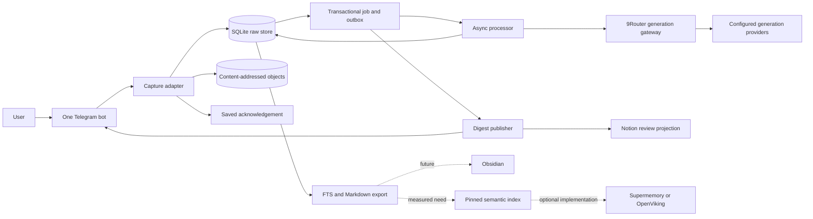
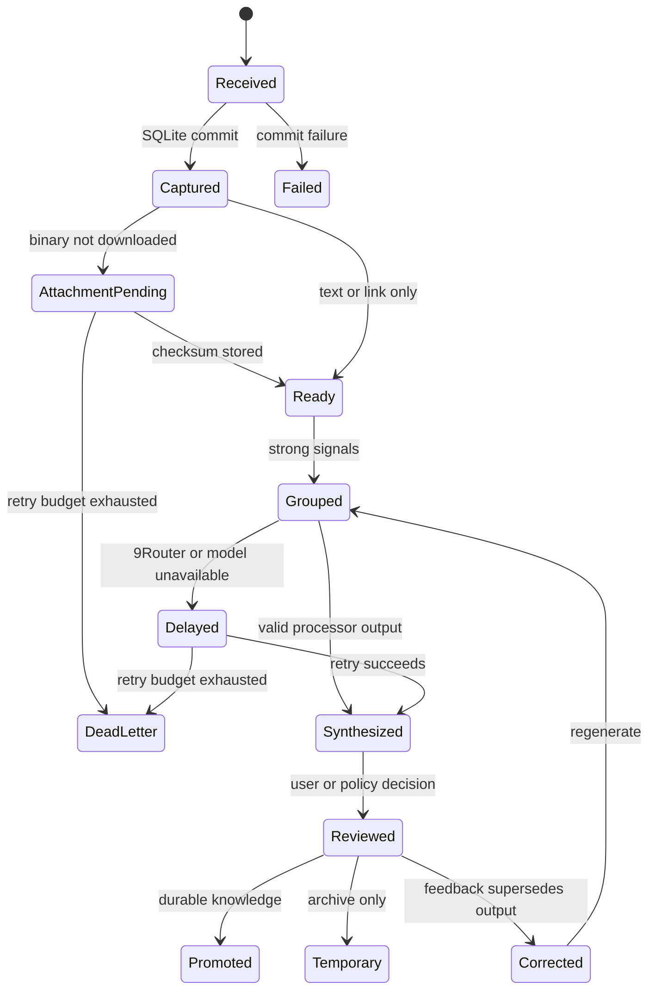
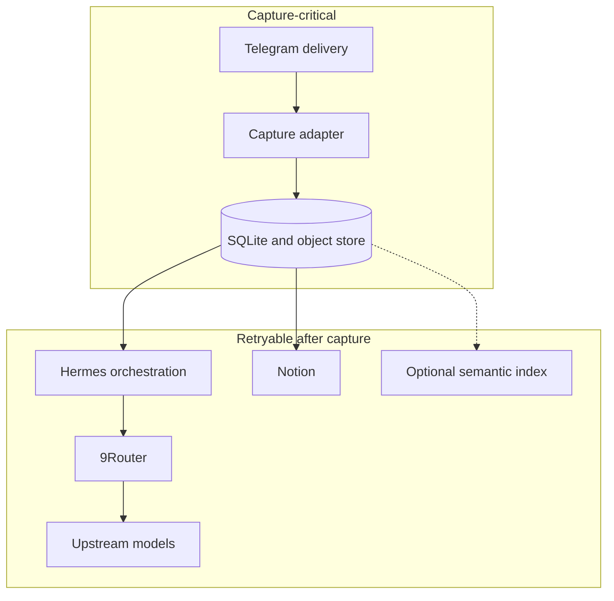
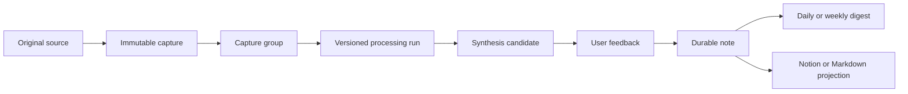

# Architecture diagrams

## MVP runtime

```mermaid
flowchart LR
    U["User"] --> T["One Telegram bot"]
    T --> C["Capture adapter"]
    C --> S[("SQLite raw store")]
    C --> O[("Content-addressed objects")]
    C --> A["Saved acknowledgement"]
    S --> J["Transactional job and outbox"]
    J --> P["Async processor"]
    P --> R["9Router generation gateway"]
    R --> L["Configured generation providers"]
    P --> S
    J --> D["Digest publisher"]
    D --> T
    D --> N["Notion review projection"]
    S --> F["FTS and Markdown export"]
    F -. "future" .-> B["Obsidian"]
    F -. "measured need" .-> X["Pinned semantic index"]
    X -. "optional implementation" .-> M["Supermemory or OpenViking"]
```

9Router is downstream of durable capture. Dashed components are absent from MVP.

## Capture lifecycle

```mermaid
stateDiagram-v2
    [*] --> Received
    Received --> Captured: SQLite commit
    Received --> Failed: commit failure
    Captured --> AttachmentPending: binary not downloaded
    AttachmentPending --> Ready: checksum stored
    AttachmentPending --> DeadLetter: retry budget exhausted
    Captured --> Ready: text or link only
    Ready --> Grouped: strong signals
    Grouped --> Synthesized: valid processor output
    Grouped --> Delayed: 9Router or model unavailable
    Delayed --> Synthesized: retry succeeds
    Delayed --> DeadLetter: retry budget exhausted
    Synthesized --> Reviewed: user or policy decision
    Reviewed --> Promoted: durable knowledge
    Reviewed --> Temporary: archive only
    Reviewed --> Corrected: feedback supersedes output
    Corrected --> Grouped: regenerate
```

## Availability boundaries

```mermaid
flowchart TB
    subgraph Critical["Capture-critical"]
        TG["Telegram delivery"]
        CA["Capture adapter"]
        DB[("SQLite and object store")]
        TG --> CA --> DB
    end
    subgraph Deferred["Retryable after capture"]
        H["Hermes orchestration"]
        R9["9Router"]
        UP["Upstream models"]
        NO["Notion"]
        IX["Optional semantic index"]
        H --> R9 --> UP
    end
    DB --> H
    DB --> NO
    DB -.-> IX
```

## Provenance chain

```mermaid
flowchart LR
    SRC["Original source"] --> CAP["Immutable capture"]
    CAP --> GRP["Capture group"]
    GRP --> RUN["Versioned processing run"]
    RUN --> CAN["Synthesis candidate"]
    CAN --> FB["User feedback"]
    FB --> NOTE["Durable note"]
    NOTE --> DG["Daily or weekly digest"]
    NOTE --> PROJ["Notion or Markdown projection"]
```

