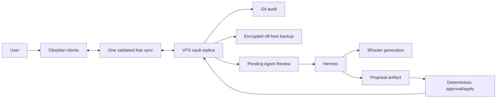
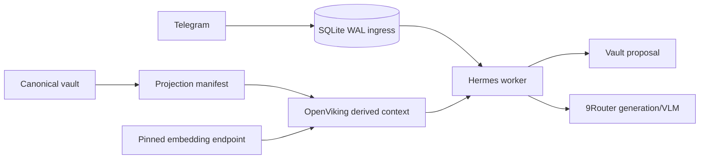
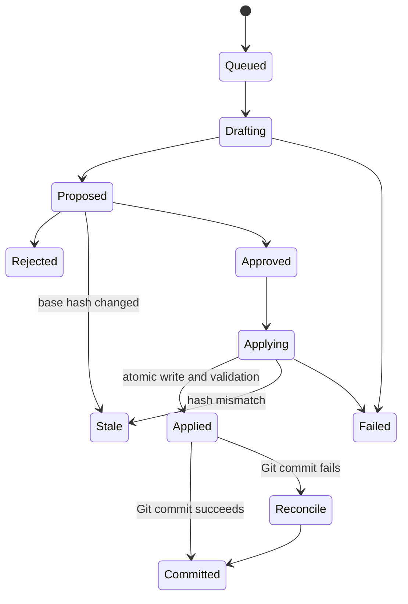
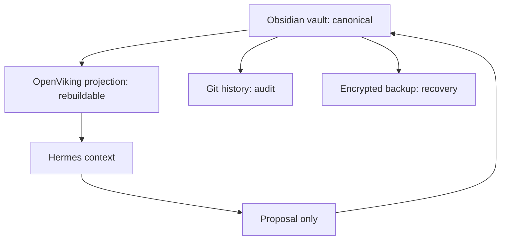
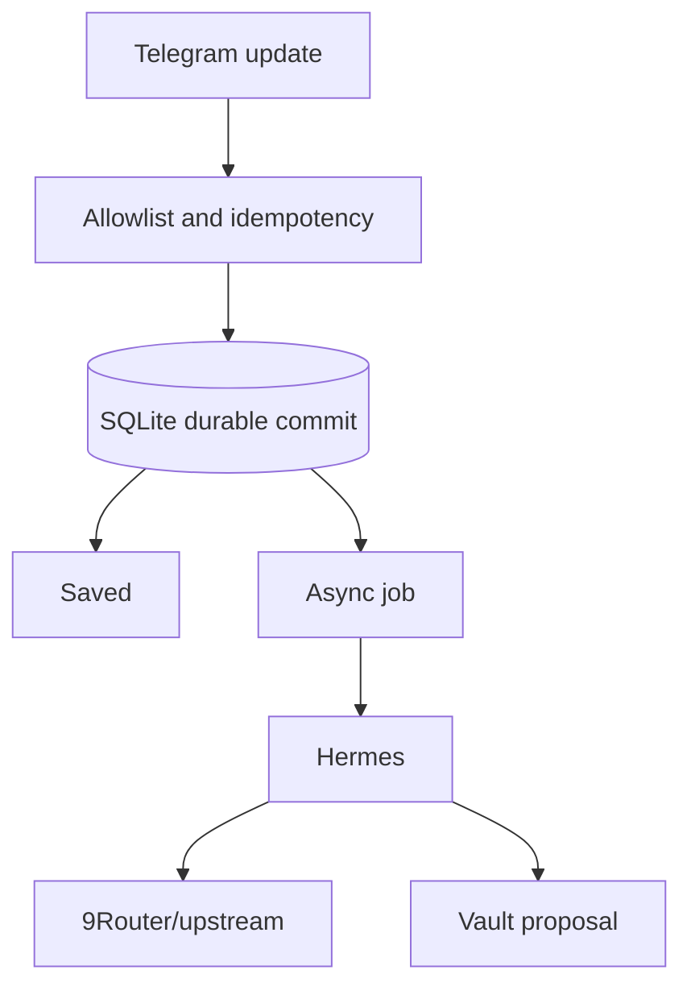

# Architecture diagrams

## First release

## Optional later services

## Proposal state

## Authority and derivation

Sync copies canonical bytes. Git records history. Backup recovers data. OpenViking derives context. None grants Hermes authority.

## Telegram availability boundary

For text/link, full-synchronous SQLite commit precedes `Saved`. Media first confirms durable metadata/pending attachment; final confirmation follows durable bytes/checksum. Every model/agent component may fail and retry.
