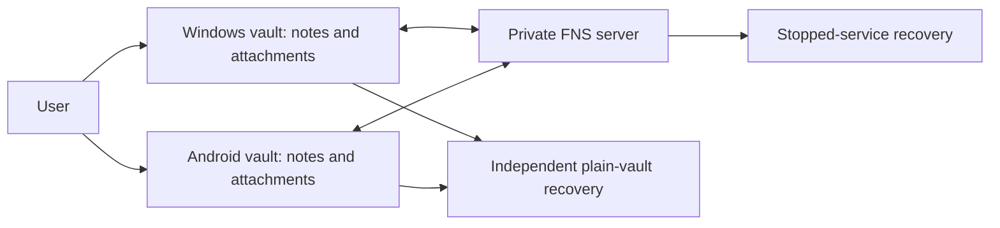
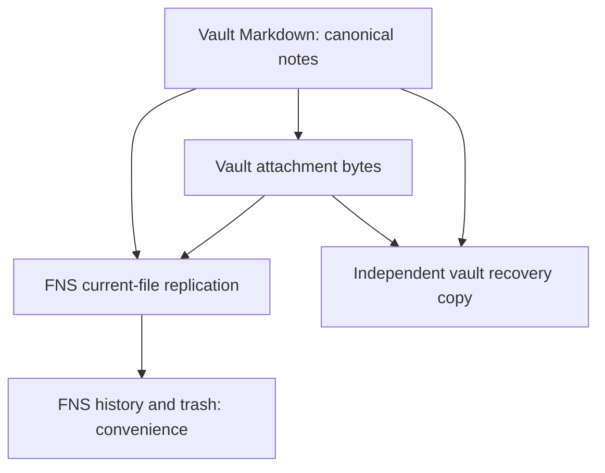
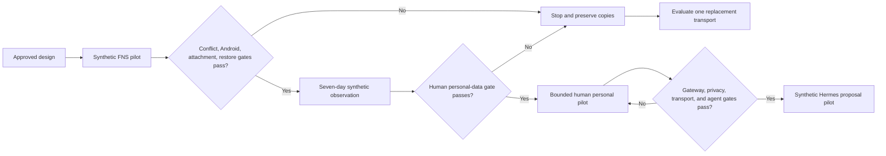
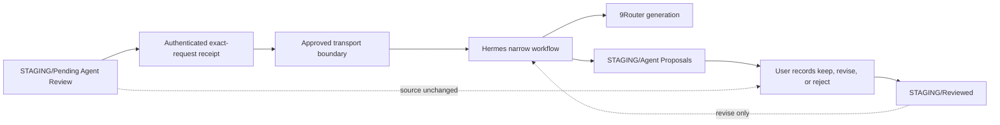
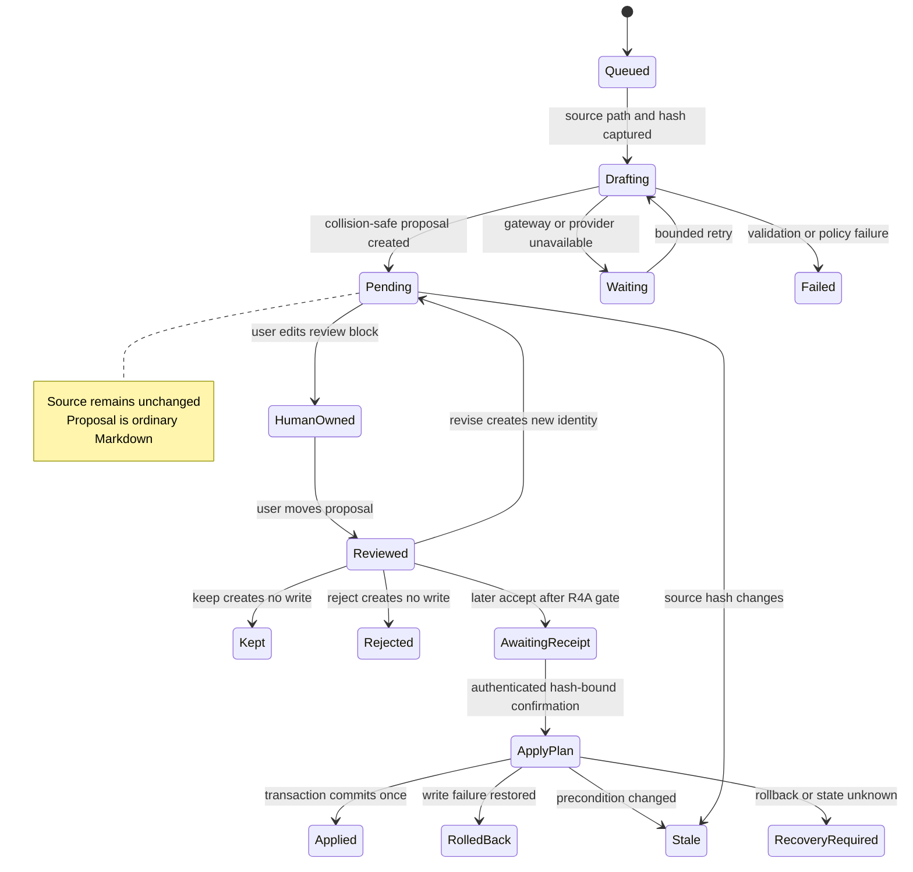
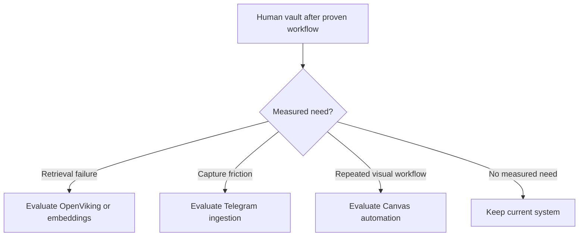

# Architecture diagrams

Status: current diagrams under [system design](../system-design.md).

## Human-only pilot

Hermes, 9Router, FNS APIs, headless clients, Git automation, and second sync engines are outside this release.

## Authority and copies

Replication is not backup. Product history remains inside FNS failure domain. Independent copy includes actual note and attachment bytes.

## Evidence-gated promotion

Passing one gate grants only next bounded stage. Human sync never implicitly authorizes agent access.

## Later proposal-only Hermes

Existing-note writes, automatic filing, deletion, rename, merge, and link repair remain outside scheduled flow.

## Later proposal state

Release 3 has no apply state. Release 4A adds immutable authenticated approval and deterministic transaction only after separate promotion.

## Deferred extensions

Deferred components are experiments, not empty boxes waiting for installation.
