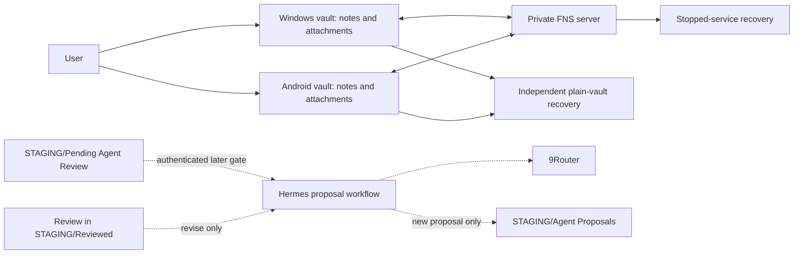

# Recommended architecture

Status: current architecture module under [system design](../system-design.md).

## Core

Obsidian vault is canonical human library. User writes directly on Windows and Android. Fast Note Sync is only whole-vault transport during isolated human pilot and owns live synchronization of both Markdown and ordinary vault attachments. No separate attachment-offload plugin participates.

Hermes and 9Router remain outside current runtime. Later Hermes integration creates separate proposals only after sync, recovery, gateway, transport, authorization, and privacy gates pass. No custom workspace service, workflow SQLite, OpenViking, embeddings, Telegram ingestion, or automatic apply belongs to current architecture.

## Component contract

| Component | Human pilot role | Later role | Failure effect |
|---|---|---|---|
| Obsidian | Main writing and reading UI; canonical local Markdown | Proposal review UI | Local files remain usable |
| FNS plugin | Current-file sync, history, trash, attachment transfer | Human sync unless later replaced | Local edits wait for convergence |
| FNS server | Private synchronization database | No automatic agent authority | Restore from stopped-service copy |
| Native vault attachments | Same capture, links, embeds, and offline files on both clients | Same unless later evidence changes it | Local bytes remain; FNS transfer may wait |
| Independent recovery copy | Restore vault and service state | Include later proposal evidence | Failed restore blocks promotion |
| Hermes | Disabled | Approved-request scanner and proposal creator | Queue stays unchanged |
| 9Router | Existing but not on human-sync path | Permitted generation gateway | Proposal waits |

## Critical paths

- **Local writing:** Obsidian plus local filesystem.
- **Cross-device current files:** Obsidian clients plus FNS plugin/server.
- **Attachment capture:** normal Obsidian actions plus vault files on each client; FNS transfers both references and bytes.
- **Disaster recovery:** stopped client activity, FNS service snapshot, independent vault copy, restore documentation.
- **Later proposal:** queue intent plus authenticated exact-request receipt, approved transport, Hermes workflow, 9Router, separate proposal file.

No optional component may become prerequisite for ordinary writing. History, trash, and model access remain independently degradable.

## Authority

- Human notes: vault Markdown.
- Agent proposals later: new vault Markdown under `STAGING/Agent Proposals`; explicit human feedback moves reviewed proposal to `STAGING/Reviewed`.
- Attachments: vault bytes with normal Obsidian links or embeds, synchronized by FNS.
- FNS history/trash: convenience recovery inside live service.
- Independent copy: disaster recovery, verified by restore.
- Review permission later: exact queue request, explicit context, and authenticated receipt outside synchronized vault; never possession of sync credentials.

## Why no operational database or mutation service

Current agent behavior does not apply proposals automatically. Source-path plus exact content hash can derive proposal identity in a narrow workflow. Separate proposal creation is idempotent enough without a workflow database because duplicate proposals are tolerable and silent note mutation is not.

Release 4A requires narrow local approval receipts, transaction journal, and result receipts for deterministic apply. These are later operational safety state, not canonical knowledge or general workflow database. Current release does not prebuild them.

## Sync selection

FNS ranks first for desired human experience, not for universal correctness or server trust. Integrated setup, history, trash, attachments, and Obsidian-native controls justify an isolated pilot. Promotion depends on physical conflict, rename, Android, attachment, external-file, server-upgrade, and restore tests.

Syncthing core plus Syncthing Manager replaces FNS only after a failed FNS gate or an explicit decision that plain-file Hermes access outweighs FNS UX. Self-hosted LiveSync remains mature candidate after encrypted CLI push issue `#1036` is fixed and ARM64-tested. Never stack transports.

## Attachment contract

- Windows uses normal paste, drop, and selection; Android uses paste where supported plus capture or selection.
- Every live attachment byte stays inside vault and FNS synchronizes it.
- Cloud Preview automatic local deletion remains off.
- Large files, background transfer, rename, move, delete, and recovery remain physical pilot gates.
- Drive, S3, CDN, external-folder, and whole-vault cloud plugins stay outside live capture.
- Original filenames and core `SYSTEM/Media` remain default; automatic
  attachment rename/move plugins stay disabled until mobile/link safety is
  proven.

Vault files remain one attachment content authority. Platform-native gestures produce same local-file, link/embed, privacy, and recovery outcome on both devices. This costs client/server storage and may expose FNS transfer limits that pilot must measure.

## Phase 2 workspace surface

Core Bases, Properties, Templates, Daily Notes, Bookmarks, Search, Backlinks,
and File Recovery provide Dusk-like navigation without its plugin chain.
Minimal theme, Minimal Theme Settings, Homepage, shallow root sorting, Lazy
Loader policy, and one CSS snippet are reversible presentation helpers; they
gain no agent or network authority. FNS and Homepage load immediately.

All FNS optional Storage Configuration providers remain disabled. They are
backup/export targets, not live transport. Google Drive has no native adapter;
no rclone/WebDAV bridge, mount, second sync engine, or attachment offload enters
this release.

## Agent promotion boundary

Hermes stays disabled until all human gates pass and a new decision selects access transport. Minimum later contract:

- scan only pending queue;
- distinguish moved raw note from sidecar request for already-filed canonical note;
- read only exact queued source and explicitly approved context after authenticated receipt;
- treat note text as untrusted data;
- create separate collision-safe proposal;
- read human feedback only from workflow-created proposal explicitly moved to `STAGING/Reviewed`;
- create a replacement only for `Decision: revise`; `keep` and `reject` cause no write;
- never mutate existing note in scheduled run;
- keep sync and provider credentials isolated;
- leave queue unchanged on failure;
- prove gateway stability and sanitized logging.

After proposal-only and learning-loop validation, Release 4A may separately grant reviewed apply and weekly changed-note link-gardening scope. That capability reads only allowlisted changed PARA/ZETA notes plus narrow plain-search candidates; every inspected body counts against fixed local budget and provider disclosure has smaller ceiling. Synchronized review records intent; authenticated one-time receipt binds immutable plan. Deterministic executor canonicalizes paths and applies one logical transaction only with compare-and-swap or proven exclusive maintenance window, preimages, immediate byte checks, atomic replacements, journaled postimages, post-write verification, and rollback only over unchanged executor postimage. Capability can be disabled without removing proposal-only workflow.

## Promotion order

1. Restore rich documentation authority and keep runtime unchanged.
2. Deploy private synthetic FNS environment.
3. Prove Windows/Android sync, native attachment, conflict, and history behavior.
4. Prove stopped-service and independent recovery.
5. Observe synthetic daily use for seven days.
6. Decide human personal-data promotion.
7. Stabilize Hermes gateway and design explicit agent transport.
8. Pilot proposal-only Hermes on synthetic vault.
9. Validate proposal-assisted learning.
10. Pilot reviewed apply and weekly link gardening only after separate gate.
11. Consider retrieval or other extensions only after measured need.

See [first production-worthy release](../roadmap/mvp.md) and [phased roadmap](../roadmap/phased-roadmap.md).
