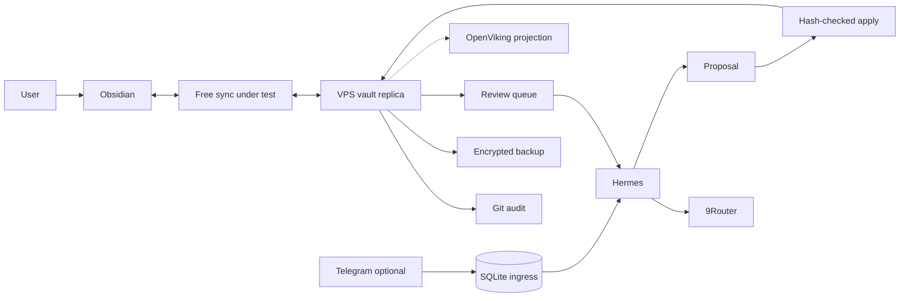

# Recommended architecture

Status: proposed; sync choice remains experimental.

## Core

Obsidian vault is canonical human library. User writes directly. Dusk-inspired folders help navigation but never block capture. Hermes creates proposals; deterministic workspace service applies approved changes with expected hashes. OpenViking is later rebuildable projection. 9Router is downstream generation/VLM gateway.

## Component contract

| Component | First-release role | Later role | Failure effect |
|---|---|---|---|
| Obsidian | Main writing/review UI and canonical files | Same | Local files remain usable |
| Free sync | Device/VPS convergence | Same | Local edits queue; no silent loss |
| Git | Narrow accepted-history checkpoints | Diff/rollback/audit | Mutation marked uncommitted |
| Backup | Encrypted off-host recovery | Same | Alert until restore proves healthy |
| Hermes | Proposal orchestration | Rich workflows/context | Notes still usable |
| Workspace service | Path policy, journal, CAS, atomic apply | Stable mutation boundary | No agent writes |
| 9Router | Permitted replaceable generation/VLM | Same | Proposals wait |
| OpenViking | Not in first release | Derived search/context | Vault unaffected; rebuild later |
| Telegram ingress | Not in first release | Optional durable quick capture | Obsidian unaffected |

## Why operational SQLite remains

OpenViking overlaps semantic storage, but not transaction boundaries for a truthful Telegram `Saved`, proposal idempotency, or optimistic write concurrency. Tiny SQLite WAL stores only ingress events, jobs, proposals, and apply journal. Knowledge remains Markdown.

## Authority

- Any canonical existing page: human-owned, proposal required.
- Generated proposal/report path: agent may create automatically.
- Update/move/rename/merge/delete: explicit approval.
- `.obsidian`, `.git`, sync state, backups, secrets: forbidden.
- OpenViking copy: disposable and never written back as independent truth.

## Sync shortlist

Run one candidate at a time:

1. Self-hosted LiveSync plus its current headless CLI.
2. Remotely Save plus compatible storage and VPS convergence mechanism.

Syncthing needs maintained community Android client and is fallback, not default. Git-only sync is acceptable only if user accepts manual/desktop-first phone workflow.

## Model split

- 9Router combo: routine replaceable generation on permitted data.
- 9Router exact route: quality-critical generation or experimental pinned embedding only when exact identity is guaranteed.
- Local Ollama embedding: privacy/availability experiment.
- No local CPU VLM fallback by default.

## Promotion order

1. Vault, review habit, sync, Git, backup.
2. Proposal-only Hermes and deterministic apply.
3. 9Router generation with data policy and logging controls.
4. OpenViking projection after retrieval benchmark.
5. Telegram ingress after durable receipt service exists.
6. Canvas/automation after concrete repeated use case.
