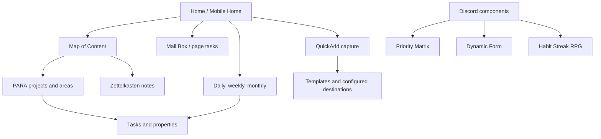

# Dusk surface, workflow, and security map

Date: 2026-07-25

Status: Goal 1 discovery. Candidate surfaces and boundaries only.

## Workflow map

Source Dusk provides navigation and examples, not a single independent
application. Each rich surface is a note plus exact paths/properties, CSS, and
community runtime dependencies.

## Surface dependency ledger

| Surface | Source implementation | Reads | Can write or execute | Desktop / Android finding |
|---|---|---|---|---|
| Home | Tabs, Dataview, DataviewJS, JS Engine, Meta Bind buttons, QuickAdd command, Todoist block, CSS | Tasks, daily state, configured links | DataviewJS/JS Engine execute; QuickAdd creates; Meta Bind invokes commands; Todoist can use network | **Blocked on both:** task cards showed `Dataview JS queries are disabled`; full Home also exposed raw `BUTTON[...]` and Datacore source. Todoist stayed off |
| Map of Content | Inline `datacorejsx` and JSON configuration | Vault metadata, configured exclusions/grouping | JSX can create files, edit configuration, and invoke vault APIs | **Blocked on both:** displayed raw DatacoreJS source, not interactive map UI |
| Mail Box | Inline `datacorejsx`, page-task properties, filters | Note properties, status, dates, paths | JSX controls can update task/page state | **Blocked on both:** displayed raw DatacoreJS source, not inbox UI |
| Project page | Meta Bind inputs and project properties | Connections, dates, priority, status | Inputs write frontmatter directly | Readable on Android; write behavior not exercised |
| Area page | Dataview and Tasks queries plus Templater-generated tags | Area-linked projects/tasks | Tasks completion and generated templates write note content | Readable; lower task content needs scrolling |
| Daily note | Calendar navigation, Dataview/DataviewJS, Tasks | Dated tasks and meetings | Tasks completion; DataviewJS execution; template creation | Static text readable; dynamic Overview blocked by disabled DataviewJS |
| Weekly/monthly | Calendar timeline and DataviewJS task aggregation | Vault-wide tasks and date fields | Query code executes; templates create notes | Static text readable; dynamic Overview blocked by disabled DataviewJS |
| Capture | QuickAdd choice and templates; Discord Dynamic Form is separate | Template/configured prompt values | QuickAdd scripts and Dynamic Form create folders/notes at configured paths | Built-in source action visible; creation not exercised |
| Templates/properties | Templater expressions, Meta Bind, exact English keys | File/folder/date context | Templater runs JavaScript and frontmatter writes | Raw template opened; execution not proved |
| Search | Core Search and Omnisearch | Note bodies, names, metadata | Local index/config writes | Existing English queries worked; new Vietnamese fixture unresolved |
| Toolbars/FAB | Note Toolbar, Commander, Editing Toolbar, configured commands | Command registry and per-note configuration | Can invoke any configured write/network command | Commander 0.5.2 startup/mobile defects; AI consent newly appeared |
| Tabs/navigation | Tabs, Home Tab, Homepage, Quick Explorer, Recent Files, Hotkeys | Workspace and path state | Some plugins create tab markup or perform file operations | Quick Explorer is desktop-only; mobile must not depend on it |
| Themes/icons/CSS | Minimal, Minimal Settings, Style Settings, Iconic, Hider, snippets | Theme and path metadata | Settings/icon metadata writes; CSS can hide controls | Visually coherent; global CSS raises accessibility/regression risk |
| Attachments | Paste Image Rename, Excalidraw, full-only Image Toolkit | Attachments and links | Rename, create, or rewrite attachment links | Rename workflow untested; Image Toolkit desktop-only |
| Priority Matrix | Three Discord copies; current Git copy uses Datacore JSX/JSON | Exact paths and Eisenhower properties | Reads, creates, modifies notes; drag/write logic | Not installed in source runtime; defer |
| Habit Streak RPG | Discord orchestrator, UI, logic, defaults | Component-relative JSON/state | Large executable Datacore/JavaScript subsystem | Discontinued source, no tested mobile state parity |

## Security and privacy model

[Obsidian's official plugin security
documentation](https://help.obsidian.md/Extending+Obsidian/Plugin+security)
states that community plugins inherit Obsidian's access and can access files,
connect to the internet, and install programs. Restricted Mode is therefore a
trust boundary, not a compatibility toggle. The copied Dusk plugin count
amplifies that boundary even when a given plugin's advertised purpose is
visual.

### High-impact local execution and write paths

- `datacorejsx`, DataviewJS, JS Engine, QuickAdd scripts, and Templater
  templates execute code from vault files.
- Source Home combines several executable block types in one note.
- Discord Dynamic Form calls `app.vault.adapter` and creates directories and
  notes using configured paths.
- Discord Priority Matrix reads, creates, and modifies notes through Datacore.
- Meta Bind inputs, Tasks completion, Tag Wrangler, Paste Image Rename, Trash
  Explorer, Meld Encrypt, and attachment tools write or rewrite vault data.
- A copied or downloaded note containing executable fences is code when opened
  in the relevant rendering mode. Treat untrusted note content as data; review
  or remove executable blocks before enabling these engines.

No filesystem sandbox separates these plugins from the vault. Goal 2 must
constrain behavior through a minimal installed set, reviewed code/config,
pre-action checkpoints, and path-specific tests.

### Network and credential paths

| Component | Potential egress or credential | Goal 1 state |
|---|---|---|
| Todoist | Todoist token and task/note content | Token never opened or copied; plugin off |
| Editing Toolbar AI | Selected note text/prompt, provider key, provider retention | Consent declined; no request sent |
| Custom Frames | Embedded sites, cookies, login/session content | Off |
| Digital Garden | Selected notes, repository/deployment credentials | Full-only and off |
| Share Note | Note content and sharing service | Full-only and off |
| BRAT | Downloads and executes GitHub plugin releases | Off |
| FNS / Obsidian Sync | Vault/configuration replication | Both off in disposables |

No hidden network call was established for Datacore, Dataview, JS Engine,
Meta Bind, Tasks, or Dusk's local JSX from current evidence. That is a bounded
finding, not proof that every transitive dependency is offline.

### Configuration-sync hazard

Plugin binaries, `community-plugins.json`, workspace state, and plugin
`data.json` live under `.obsidian`. Corrected Goal 1 copies excluded all source
plugin `data.json`; this prevented credential/configuration leakage but also
proved dynamic Dusk surfaces cannot be transferred from binaries and notes
alone. A configuration-sync mechanism can
propagate an update, migration, disabled state, executable configuration, or
broken workspace to another device. Current live FNS Configuration Sync is
disabled. Keep it disabled until a selected Goal 2 configuration passes
Windows and physical Android separately and rollback is demonstrated.

### Maintenance and ownership signals

- Natural Language Dates and Projects were absent from the current official
  community registry despite existing in the source bundle.
- Garble Text, Highlightr, Grandfather, Settings Search, Paste Image Rename,
  Force Note View Mode, and Pomodoro have old/stale release histories.
- Highlightr/Settings Search has an official known interaction and a current
  runtime error.
- Several current upstream releases require a newer Obsidian than 1.12.7.
  Obsidian correctly installed latest-compatible releases instead; copying
  upstream `main.js` manually would bypass that gate.
- The source root and Git Priority Matrix copy contain licenses. No
  component-specific current license/provenance was established for every
  Discord loose file or Habit Streak RPG; do not redistribute those as
  repository-owned code without clarification.

## Recovery model

Safe plugin update rollback is a whole-vault checkpoint:

1. close exact disposable vault;
2. retain pre-open or pre-update manifest and copy;
3. run one bounded migration/update;
4. verify file additions/modifications and restart behavior;
5. restore the entire checkpoint when the result fails.

Downgrading only plugin JavaScript is insufficient because Journals, workspace,
cache, and other configuration may already have migrated. Destructive tools
need an independent backup and restore drill before first use.

## Zoomed-out risks

- Forty-plus enabled plugins create overlapping navigation, search, Home,
  task, styling, and command surfaces.
- Rich dashboards bind future notes to exact property names, paths, and
  executable engines. Translating or renaming those contracts later is a data
  migration.
- Desktop-only plugins can make a visually successful Windows workflow
  unusable on Android.
- Demo and dummy notes make dashboards look populated but are not evidence
  that the system fits real capture/review behavior.
- Android full startup's 11.7-to-19.7-second readiness window, Mali allocation
  errors, and aggregate memory cost make unchanged wholesale import unsafe.
- AI, publishing, share, embedded-frame, and Todoist features are optional
  network boundaries, not harmless toolbar additions.

## Opportunities and simpler experiments

- Preserve Dusk's intended Home, Map, Mail Box, PARA/ZETA, daily hierarchy, and
  visual language as design references without copying its whole runtime.
- In Goal 2, inspect and rebuild only minimum non-secret fields needed by one
  chosen dynamic surface, or replace that surface with native behavior. Never
  copy source `data.json` wholesale.
- Test native
  [Properties](https://help.obsidian.md/Editing+and+formatting/Properties),
  [Bases](https://help.obsidian.md/Bases/Introduction), callouts, Search, and
  Templates against one real workflow before retaining equivalent plugins.
- Keep ISO machine dates while using locale-aware display. The physical
  Android Properties view already demonstrated this separation.
- Prefer one capture path, one task model, one search path, and one Home
  opener. Add richer write-back only after the simpler path fails a concrete
  requirement.
- Keep Discord components as separately reviewed optional modules rather than
  merging them into the base vault.
