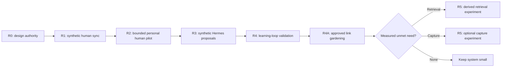

# Evidence-gated roadmap

Status: current program roadmap under accepted modular decisions through DEC-036. Each release requires its own entry gates and decision.

Phases describe promotion order and lasting boundaries, not a backlog of components waiting for installation. Every release must remain useful if every later release is abandoned.

## Program map

## Release 0: design and repository authority

### Goal

Make current system understandable without chat history while preserving research, decisions, generated work, and historical snapshots.

### Scope

- Rich modular current design under `docs/system-design.md`, `docs/architecture/`, `docs/behavior/`, and `docs/roadmap/`.
- Concise root README and documentation map as navigation, not duplicate architecture.
- Current evidence under `docs/research/`; superseded evidence under `docs/archive/`.
- Stable `main` plus short-lived task branches after legacy publisher cutover.

### Exit gate

- No duplicate current specification or roadmap.
- All Markdown reachable and links valid.
- Current decisions match every design module.
- Independent review finds no authority leak or stale active instruction.

### Rollback

Documentation-only restore. No runtime changes.

## Release 1: synthetic human sync and attachment foundation

### Goal

Prove FNS note and native attachment behavior using disposable Windows/Android vault and private FNS server.

### Scope

- Deployment contract and read-only VPS preflight.
- Non-destructive core vault bootstrap with Home, guide, templates, and exact folder set.
- Private pinned FNS server.
- Windows/Android convergence, history, trash, local attachments, conflicts, background behavior, restart, upgrade, and rollback.
- Symmetric Windows/Android native attachment capture across image, video, audio, PDF, and arbitrary binary files.
- Attachment rename/move, offline delete/restore, interrupted transfer, Android open, practical size limits, and byte equality.
- Independent FNS and plain-vault recovery including attachment bytes.
- Seven-day synthetic observation.

### Exit gate

[First production-worthy release](mvp.md) stages 0 through 9 pass and decision records one of: FNS promotion, FNS rejection, or local-only fallback.

### Rollback

Synthetic data only. Shut down isolated service, preserve evidence, and remove exact resources.

## Release 2: bounded personal human pilot

### Entry gate

Release 1 passes without unresolved silent loss, cross-vault access, external-file deletion, failed restore, or recurring Android manual repair.

### Scope

- Migrate a bounded, independently copied subset of personal notes.
- Define backup cadence, retention, and restore spot-check schedule.
- Define accepted attachment size/classes, storage budget, and independently recover every admitted byte outside FNS authority.
- Define safe `.obsidian` configuration-sync subset.
- Run at least four weeks of human-only use.
- Validate capture friction, weekly review, monthly compression, and recovery habit.

### Exclusions

- Hermes vault access.
- FNS API/MCP/headless client.
- Git automation or external filesystem writer.
- Second sync engine.

### Exit gate

- No unresolved integrity or privacy incident.
- Weekly review is useful in three of four weeks.
- At least one reviewed insight changes concrete engineering action and next review records result.
- One scheduled plain-vault/FNS restore spot-check succeeds and independently copied byte restore covers every admitted attachment category.
- User still prefers daily FNS experience after real use.

### Rollback

Return to known independent personal copy and local-only Obsidian. Preserve service state for diagnosis; do not let empty replacement overwrite surviving device.

## Release 3: proposal-only Hermes pilot

### Entry gates

- Release 2 stable.
- Hermes gateway runs under one authoritative supervisor with sustained health.
- 9Router logging, provider, model, retention, and privacy boundaries verified with synthetic content.
- Explicit agent transport decision approved after FNS token/external-writer tests or transport replacement.
- Queue, sidecar request, authenticated read receipt, context, proposal identity, canonical path allowlist, and visible failure contract approved.

### Scope

- Hermes bundled Obsidian skill plus one narrow proposal workflow.
- Scan only `STAGING/Pending Agent Review` for moved raw sources or sidecar requests and `STAGING/Reviewed` for workflow-created proposals carrying explicit human review.
- Require authenticated receipt outside synchronized vault before provider read.
- Read exact queued source plus context explicitly bound to receipt.
- Create separate deterministic proposal under `STAGING/Agent Proposals`.
- Create replacement proposal only for reviewed `Decision: revise`; reviewed `keep` and `reject` create no write.
- Leave source unchanged.
- Run duplicate, stale-source, prompt-injection, forbidden-path, outage, collision, and recovery tests.

### Exclusions

- Scheduled existing-note mutation.
- Automatic apply, filing, move, rename, merge, delete, archive, or link repair.
- Custom watcher/service and workflow SQLite.
- OpenViking, embeddings, Telegram ingestion.

### Exit gate

- Note outside queue causes zero Hermes/9Router request.
- Forged queue state without matching receipt causes zero Hermes/9Router request.
- Already-filed source remains at canonical path when sidecar request is used.
- Source prompt cannot widen context, invoke tool, expose credential, or authorize write.
- Matching source produces at most one effective proposal identity.
- Matching reviewed proposal bytes produce at most one effective revision identity.
- Changed source cannot be overwritten by old output.
- Gateway outage leaves queue and source unchanged.
- Human sync and recovery remain unaffected.

### Rollback

Disable schedule and revoke agent transport credential. Human Obsidian/FNS system remains complete.

## Release 4: learning-loop validation

### Goal

Prove agent proposals improve understanding and practice instead of increasing note volume.

### Scope

- Four weeks of selected queued-note proposals.
- Weekly own-words review and one action.
- Monthly compression of changed beliefs, demonstrated skills, blockers, and next deliberate practice.
- Compare human-only weeks with proposal-assisted weeks for time, usefulness, and action follow-through.

### Exit gate

- Proposals save or justify their review time.
- Three of four weeks yield useful own-words insight plus applied example and next action.
- Duplicate/stale proposal burden remains low enough for manual handling.
- Ordinary notes still receive no background processing.

### Rollback

Disable Hermes schedule and keep manual workflow. No data migration required because proposals are plain Markdown.

## Release 4A: approved filing and link gardening

### Entry gates

- Release 4 proves proposal-assisted review worth its cost.
- Agent transport supports bounded read/write, authenticated approval, compare-and-swap or proven exclusive maintenance window, visible failure, and tested recovery.
- Exact PARA/Zettelkasten scan allowlist, denied roots, patch sections, and external checkpoint location approved.
- Canonical cross-platform path policy, private preimage location/retention, deterministic executor, transaction journal, and result receipts approved.
- EXP-014 passes with synthetic fixtures.

### Scope

- Accepted proposal may create clean final note at displayed destination and apply displayed dependent-note patches.
- Old-note changes initially limited to additive links inside approved sections.
- One weekly changed-note scan plus manual on-demand scan.
- One link-review digest per run under `STAGING/Agent Proposals`; no digest when no useful recommendation exists.
- Candidate discovery uses filename, aliases, links, tags, and plain-text search.
- Hard ceiling per run: 20 changed notes, 5 candidates per changed note, 2,000 filename-only paths, 100 content-inspected files, 1 MiB local content reads, 250 KiB provider text, 64 KiB per note, 10 model requests, 20 recommendations, and 15 minutes.
- User moves reviewed plan or digest to `STAGING/Reviewed`; `accept` or per-item `apply` records intent.
- Authenticated one-time receipt binds unchanged reviewed hash and plan before deterministic executor may write.
- Executor rejects noncanonical paths, preflights whole transaction, preserves preimages, performs atomic writes with immediate byte and post-write checks, journals executor postimages, and rolls back only while current bytes equal postimage.
- Rebuildable path/hash checkpoint outside vault; no note text, watcher, workflow SQLite, or derived content index.
- Receipt and recovery retention: 15-minute unused approval expiry, 90-day used hash-only receipt/journal, and preimages for at least 30 days plus next verified independent post-state recovery.

### Exclusions

- Daily full-vault scan.
- Unreviewed filing, patching, moving, renaming, deleting, merging, archiving, or link repair.
- Target discovery during apply.
- Arbitrary old-note prose rewrite.
- Embeddings or OpenViking.

### Exit gate

- Four weekly scans remain useful without excessive noise or provider cost.
- No denied-path or full-vault disclosure occurs.
- Exact approved changes apply once; stale targets stay unchanged with visible result.
- Forged, expired, edited, colliding, escaping, concurrent, or unknown-state apply causes no unreviewed mutation.
- Interrupted transaction commits once or restores preimages only over unchanged executor postimages; concurrent mismatch or failed rollback preserves all versions and disables executor.
- Weekly/manual same-day runs use create-only deterministic run IDs; checkpoint never advances ahead of durable digest or journaled zero result.
- Recovery restores every touched fixture.
- Expired receipts fail closed; retention cleanup removes only exact eligible receipts/preimages and records no private path.
- Daily frequency remains disabled unless measured backlog justifies new decision.

### Rollback

Disable link-gardening schedule and revoke write scope. Preserve reviewed plans and recovery evidence. Proposal-only Hermes and human workflow remain usable.

## Release 5A: derived retrieval experiment

### Trigger

Repeated, recorded failure of filename, link, and text search on meaningful bilingual queries after sufficient real notes exist.

### Scope

- Prewritten query set and answer key.
- Compare plain Obsidian search against one derived candidate such as OpenViking.
- Define permitted projection, exact version, index/embedding contract, provenance, deletion, rebuild, privacy, and ARM64 resource use.
- Keep projection read-only and rebuildable.

### Exit gate

Material retrieval improvement with source provenance, successful delete/rebuild lifecycle, acceptable resource/cost/privacy, and no canonical mutation.

### Reject when

Improvement is marginal, identity cannot be pinned, deletion/rebuild is unreliable, or external disclosure exceeds value.

## Release 5B: optional capture experiment

### Trigger

Direct Obsidian capture remains measurably too slow or unavailable in repeated real situations.

### Scope

Design Telegram or another quick-capture path separately. Durable receipt, attachment persistence, duplicate handling, outage, privacy, and recovery require their own authority and test contract.

### Boundary

Ordinary Hermes Telegram chat is not Obsidian ingestion. No chat message writes vault until separate design is approved.

## Release 5C: visual or broader workflows

Canvas creation, managed sections, generated reports, richer project research chains, or custom UI begin only from repeated concrete demand. Each receives separate design and must not expand existing-note mutation silently.

## Decision lanes

### If FNS fails

1. Stop FNS for affected vault.
2. Preserve client/server copies and evidence.
3. Restore known good independent copy.
4. Evaluate Syncthing core plus Syncthing Manager on new disposable vault.
5. Reconsider LiveSync only after encrypted CLI fix and ARM64 proof.

### If native attachment transfer fails

Keep original source and FNS evidence, block affected file class or personal promotion, and diagnose FNS. Do not add a second live attachment authority without a new design decision.

### If Hermes transport fails

Keep human system. Either replace transport through explicit sync decision or abandon agent integration. Never broaden token or stack sync to force automation.

### If learning loop fails

Remove or shorten proposal/review workflow before adding retrieval, more models, or more capture channels.

## Deliberately absent

Paid-service assumption, two simultaneous sync engines, Git branch switching inside live vault, automatic conflict merge, unrestricted agent shell, symmetric OpenViking/Obsidian editing, fallback embeddings with unknown identity, local CPU VLM emergency path, background existing-note mutation, and architecture justified only by possible future use.
