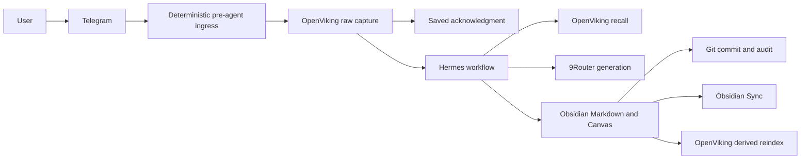

# Obsidian, OpenViking, and Hermes workspace design

Status: approved conversational design; implementation not started.
Date: 2026-07-20.

## Purpose

Expand the project from a daily knowledge pipeline into a general personal workspace operated through Telegram and Hermes. The system must support unstructured capture, durable notes, project pages, research chains, updates to existing pages, organization, reviews, and Obsidian Canvas while retaining source provenance and safe failure behavior.

The user should experience one coherent library in Obsidian. OpenViking provides machine-facing durability, memory, and retrieval. Hermes coordinates explicit workflows rather than treating two writable stores as interchangeable.

## Goals

- Create and update Obsidian Markdown pages after short or multi-step workflows.
- Use OpenViking for raw capture, long-term agent memory, resource storage, and semantic retrieval.
- Let Hermes search OpenViking and operate the Obsidian vault through defined actions.
- Support generated and curated JSON Canvas files.
- Automatically maintain agent-owned material without requesting constant approval.
- Protect pages and canvases the user claims or curates.
- Use Git for history, audit, diffs, and rollback.
- Preserve raw Telegram input before model generation or acknowledgment.
- Keep 9Router and upstream model failure outside capture availability.

## Non-goals

- Treating every note as a structured knowledge artifact.
- Making OpenViking and Obsidian independent editable copies of the same canonical page.
- Allowing unrestricted autonomous vault reorganization.
- Using Git as the device-sync transport.
- Switching Git branches inside the live synchronized vault.
- Requiring review for every generated note or metadata update.
- Storing important content only inside Canvas text cards.

## Approaches considered

### Obsidian only

Obsidian owns every file and Hermes uses filesystem search. This is simplest and most portable, but weakens semantic recall, agent memory, raw-ingestion recovery, and multimodal resource handling as the library grows.

### Symmetric Obsidian and OpenViking

Both systems hold writable versions of the same notes and Hermes decides where to write. This maximizes features but creates conflicting truth, ambiguous deletion, synchronization loops, and hard recovery. Rejected.

### Authority split

OpenViking owns raw captures and agent-facing context. Obsidian owns human-visible Markdown and Canvas. OpenViking may index Obsidian content as a derived resource; Hermes writes canonical pages only through the Obsidian boundary. Recommended.

## Authority model

| Component | Authority | Must not own |
|---|---|---|
| Telegram | Capture, commands, approvals, status | Durable truth |
| Pre-agent ingress | Sender validation, deterministic ID, OpenViking raw write, acknowledgment ordering | Synthesis |
| OpenViking | Raw captures, processing state, agent memory, resources, semantic index | Canonical curated Obsidian pages |
| Hermes | Intent routing and workflow orchestration | Unrecorded state or unrestricted mutation |
| Obsidian | Human-visible notes, projects, reviews, canvases, attachments | Raw delivery queue |
| 9Router | Replaceable classification and generation routing | Capture persistence or fallback embeddings |
| Git | Vault history, audit, diff, rollback | Device synchronization or edit authorization by itself |
| Obsidian Sync | Vault replication between VPS and devices | Independent backup |

## Runtime architecture



Hermes' standard external-memory lifecycle synchronizes turns after a response. It therefore cannot be the raw-capture guarantee. A deterministic hook must write the incoming Telegram update to OpenViking before any 9Router/model call and acknowledge only after successful persistence.

No separate application-owned SQLite knowledge database is required. OpenViking may use its own internal persistent QueueFS/SQLite mechanisms. The ingress boundary and workflow state machine remain explicit even though storage implementation belongs to OpenViking.

## Data flow

### Raw capture

1. Validate paired/allowlisted Telegram sender and chat.
2. Derive stable capture ID from non-secret bot identity and Telegram update ID.
3. Write immutable raw text, identifiers, timestamps, reply/media relationships, attachment metadata, and initial state to deterministic OpenViking URI.
4. Treat an already-existing identical capture as idempotent success.
5. Reply `Saved` only after OpenViking confirms source persistence.
6. Schedule Hermes processing independently.

If OpenViking is unavailable, do not acknowledge success. Telegram delivery must remain retryable. A 9Router, model, Hermes processor, Obsidian, Sync, or Git outage never removes an already persisted raw capture.

### General workflow

1. Classify request into one or more supported operations.
2. Recall relevant memory/resources from OpenViking.
3. Inspect exact Obsidian targets before writing.
4. Run required research, tools, or synthesis.
5. Build deterministic file changes and validation evidence.
6. Apply changes according to edit policy.
7. Commit accepted vault changes with workflow/capture identifiers.
8. Refresh OpenViking's derived representation for changed files.
9. Report files changed, approvals required, and recoverable failures.

## Hermes operation contract

Hermes composes six operations:

- `create_note`: choose approved folder/template, create Markdown, properties, sources, and wikilinks.
- `update_note`: read target, create focused patch, apply according to edit policy, preserve unrelated content.
- `organize_notes`: propose or apply classification, properties, links, moves, and indexes under policy limits.
- `create_or_update_canvas`: create or patch valid JSON Canvas while preserving user-managed layout.
- `retrieve_context`: combine OpenViking semantic recall with exact Obsidian file inspection.
- `run_workflow`: chain research, retrieval, creation, update, organization, Canvas, reindex, and reporting.

Tool choice must not determine authorization. A policy layer evaluates every planned mutation before filesystem tools run.

## Vault structure

Initial structure:

```text
00 Inbox/
10 Notes/
20 Projects/
30 Areas/
40 Resources/
50 Career Evidence/
60 Reviews/
70 Canvases/
   Generated/
   Curated/
90 Archive/
.proposals/
attachments/
```

Folders are navigation defaults, not a rigid ontology. Stable properties and wikilinks provide cross-cutting organization.

Suggested machine properties:

```yaml
id: stable-note-id
type: note
managed_by: hermes
edit_policy: auto
status: active
source_ids: []
created: 2026-07-20
updated: 2026-07-20
```

Required properties vary by note type, but `id`, `managed_by`, and `edit_policy` have stable semantics.

## Edit governance

### Policies

| Policy | Meaning |
|---|---|
| `auto` | Hermes may make non-destructive updates and commit them automatically. |
| `review` | Hermes prepares a focused proposal/diff and waits for approval. |
| `managed-sections` | Hermes may update only bounded generated sections. |

Agent-created notes default to `managed_by: hermes` and `edit_policy: auto`. A user claims a note by moving it into a protected location, setting `edit_policy: review`, or telling Hermes to protect it. Protection is explicit; Git history alone does not determine ownership.

### Managed sections

Shared pages contain bounded regions:

```markdown
<!-- hermes:start related-notes -->
## Related notes

- [[Example]]
<!-- hermes:end related-notes -->
```

Hermes may replace content only between matching markers. Missing, duplicated, or malformed markers convert operation to review-required failure.

### Always require review

- Delete, merge, archive, or overwrite human-owned content.
- Rename or move user-owned pages.
- Bulk folder/property/taxonomy changes.
- Changes outside managed sections on shared pages.
- Restructuring manually curated Canvas.
- Any operation with ambiguous target or conflicting concurrent edit.

New pages, agent-owned notes, generated reviews/indexes, and generated canvases do not require routine approval unless operation is destructive.

## Git design

Git provides history, rollback, and inspection, not sync or authorization.

- Hermes uses dedicated commit identity.
- Each accepted workflow produces a narrow commit with workflow/capture IDs in body or metadata.
- Auto-policy changes commit directly to active vault branch.
- Review-policy changes become proposal artifacts under `.proposals/`; original page remains untouched.
- Approval applies proposal, validates result, removes proposal, and creates commit.
- Full branch/PR workflows use a separate clone, never branch switching inside live Obsidian Sync directory.
- Git pull, rebase, reset, and checkout are prohibited in live vault automation.
- Obsidian Git plugin is optional. If enabled, it must not run a competing automatic pull/commit loop beside VPS automation.
- Obsidian Sync replicates files; independent encrypted backup protects both vault and Git repository.

Example subjects:

```text
hermes(create): add Spring transaction note
hermes(digest): refresh week 30 review
hermes(canvas): refresh backend roadmap
hermes(organize): classify inbox batch
```

## Canvas design

Canvas is a visual projection stored as open JSON Canvas `.canvas` files.

- Valuable content lives in Markdown files; Canvas file nodes reference those notes.
- Text-only Canvas cards contain labels or disposable annotations, not canonical knowledge.
- Generated canvases live under `70 Canvases/Generated` and may refresh automatically.
- Curated canvases live under `70 Canvases/Curated` and require review for structural changes.
- Updates preserve existing node IDs, user positions, sizes, colors, labels, edges, groups, and unknown fields unless requested otherwise.
- New IDs never collide with existing nodes or edges.
- Layout generation is deterministic for unchanged inputs.
- Every write validates JSON syntax, node/edge references, unique IDs, and referenced vault paths.

Canvas needs a dedicated Hermes workflow skill because bundled Obsidian instructions cover Markdown/file operations but not JSON Canvas semantics.

## OpenViking relationship to Obsidian

- Raw Telegram captures remain canonical OpenViking resources.
- Agent memories remain OpenViking memories.
- Obsidian pages remain canonical human artifacts.
- OpenViking's representation of Obsidian files is derived and rebuildable.
- Hermes edits Obsidian first, then refreshes the derived OpenViking resource.
- OpenViking recall returns source URI plus Obsidian stable note ID/path when applicable.
- Deleting or moving an Obsidian page updates OpenViking only after approved filesystem change succeeds.
- OpenViking never writes an independent curated-page version expecting Obsidian to reconcile it.

Embeddings use an explicitly pinned model/dimension/preprocessing/index-generation contract. No 9Router combo may transparently substitute embedding models.

## Synchronization and backup

Default deployment uses official Obsidian Sync with end-to-end encryption and official headless client on VPS. Hermes operates the headless-synchronized VPS vault. Sync is transport, not backup.

- Store E2EE recovery material outside VPS and vault.
- Run encrypted off-host vault backup with retention and restore drills.
- Back up OpenViking source storage, configuration, and required encryption keys independently.
- Back up Git repository including objects and refs.
- Do not expose vault, OpenViking, or management endpoints publicly without authenticated private boundary.

Self-hosted Obsidian synchronization is outside first implementation because it adds conflict, mobile, authentication, and recovery work unrelated to workspace behavior.

## Failure handling

| Failure | Required behavior |
|---|---|
| Duplicate Telegram update | Same capture URI; no duplicate processing/output. |
| OpenViking unavailable before capture | No `Saved`; retain Telegram retry path. |
| Hermes or 9Router unavailable | Capture remains pending; process later. |
| Invalid model output | Reject mutation; preserve raw capture and report/retry. |
| Obsidian unavailable | Keep OpenViking job pending; do not mark workflow complete. |
| Sync unavailable | VPS write and Git commit remain local; Sync retries independently. |
| Concurrent note edit | Detect base hash mismatch; create proposal instead of overwrite. |
| Crash after note write, before status update | Deterministic note ID/path and Git inspection make replay idempotent. |
| Git commit failure | Keep file and workflow in uncommitted state; block further mutation until reconciled. |
| OpenViking reindex failure | Obsidian change remains canonical; queue derived reindex. |
| Canvas validation failure | Do not replace valid existing Canvas; retain failed proposal. |
| Backup failure | Alert visibly; success remains false until restore evidence exists. |

## Security boundaries

- Allowlist/pair Telegram identities.
- Treat captured content as untrusted data, not agent instructions.
- Separate raw/work-sensitive material by OpenViking scope and Obsidian path.
- Default uncertain workplace content to no external processing.
- Give Hermes vault access but no unrestricted destructive shell workflow.
- Use scoped OpenViking and 9Router credentials.
- Exclude secrets, sync credentials, raw private logs, and provider details from Git.
- Review community plugins/skills before installation; Canvas support should use a small auditable skill.
- Record model/prompt/workflow versions without storing secret values or unnecessary prompt bodies.

## Validation

### Behavioral scenarios

- Create new note from Telegram with source links.
- Research topic, recall related context, and update an agent-owned page automatically.
- Propose update to human-owned page without mutating original.
- Apply approved proposal and produce one Git commit.
- Update only managed section while preserving human prose byte-for-byte.
- Create generated project Canvas referencing notes.
- Attempt curated Canvas update and require approval.
- Organize inbox batch with preview for moves/renames.

### Failure scenarios

- Capture while 9Router and upstream providers are unavailable.
- Replay duplicate Telegram update.
- Crash between Obsidian write and OpenViking state transition.
- Concurrent user edit before Hermes patch.
- OpenViking reindex outage after accepted page update.
- Obsidian Sync outage and later convergence.
- Invalid Canvas node/edge/path generation.
- Restore vault, Git, and OpenViking from backups.

### Acceptance criteria

- Raw capture exists before `Saved` and before any model call.
- Human-owned files never change without approval.
- Agent-owned non-destructive changes need no routine review.
- Managed-section updates leave all other bytes unchanged.
- Every accepted mutation has one traceable Git commit.
- No workflow depends on branch switching in live vault.
- OpenViking index can rebuild from canonical Obsidian files.
- Generated Canvas opens successfully and preserves manual data on refresh.
- Failure replay does not duplicate raw capture or final page.

## Implementation decomposition

This design should become separate implementation work packages:

1. Vault, Sync, Git, and backup foundation.
2. OpenViking deployment and Hermes memory-provider integration.
3. Deterministic Telegram pre-agent capture boundary.
4. Obsidian note-operation and edit-policy skill.
5. Git proposal, approval, and rollback workflow.
6. JSON Canvas skill and validation.
7. OpenViking derived-vault indexing and recovery.
8. Behavioral, outage, conflict, and restore tests.

Each package must preserve explicit authority boundaries above.

## Sources

- [Hermes Obsidian skill](https://github.com/NousResearch/hermes-agent/blob/main/website/docs/user-guide/skills/bundled/note-taking/note-taking-obsidian.md)
- [Hermes memory providers](https://github.com/NousResearch/hermes-agent/blob/main/website/docs/user-guide/features/memory-providers.md)
- [Hermes multi-skill cron workflows](https://github.com/NousResearch/hermes-agent/blob/main/website/docs/guides/automate-with-cron.md)
- [OpenViking Hermes integration](https://docs.openviking.ai/en/agent-integrations/05-hermes)
- [OpenViking transaction and crash recovery](https://docs.openviking.ai/en/concepts/09-transaction)
- [OpenViking storage architecture](https://docs.openviking.ai/en/concepts/05-storage)
- [OpenViking context layers](https://docs.openviking.ai/en/concepts/03-context-layers)
- [Obsidian Canvas](https://obsidian.md/help/plugins/canvas)
- [JSON Canvas](https://jsoncanvas.org/)
- [Obsidian Headless](https://github.com/obsidianmd/obsidian-headless)
- [Obsidian Sync security](https://help.obsidian.md/Obsidian%20Sync/Security%20and%20privacy)
