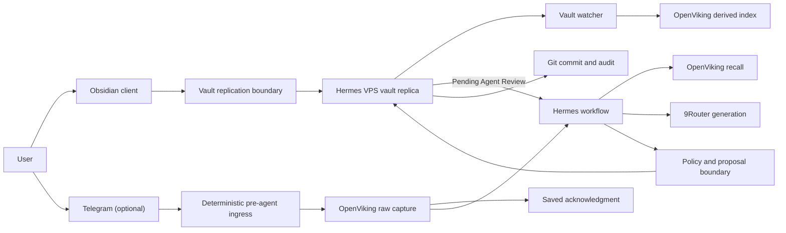

# Obsidian, OpenViking, and Hermes workspace design

Status: approved conversational design; implementation not started.
Date: 2026-07-20.
Updated: 2026-07-21.

## Purpose

Expand the project from a daily knowledge pipeline into a general personal workspace centered on direct Obsidian use. The system must support unstructured capture, durable notes, project pages, research chains, updates to existing pages, organization, reviews, and optional Obsidian Canvas while retaining source provenance and safe failure behavior. Telegram remains an optional quick-capture and remote-command channel.

The user should experience one coherent library in Obsidian. OpenViking provides machine-facing durability, memory, and retrieval. Hermes coordinates explicit workflows rather than treating two writable stores as interchangeable.

## Goals

- Create and update Obsidian Markdown pages after short or multi-step workflows.
- Treat direct Obsidian creation and editing as the primary human workflow.
- Leave ordinary notes untouched unless the user explicitly queues them for Hermes.
- Use OpenViking for raw capture, long-term agent memory, resource storage, and semantic retrieval.
- Let Hermes search OpenViking and operate the Obsidian vault through defined actions.
- Support generated and curated JSON Canvas files.
- Automatically maintain agent-owned material without requesting constant approval.
- Protect pages and canvases the user claims or curates.
- Use Git for history, audit, diffs, and rollback.
- Preserve raw Telegram input before model generation or acknowledgment.
- Keep 9Router and upstream model failure outside capture availability.
- Keep vault behavior independent of the eventual free replication provider.

## Non-goals

- Treating every note as a structured knowledge artifact.
- Making OpenViking and Obsidian independent editable copies of the same canonical page.
- Allowing unrestricted autonomous vault reorganization.
- Selecting a vault replication provider before dedicated sync research.
- Switching Git branches inside the live synchronized vault.
- Requiring review for every generated note or metadata update.
- Storing important content only inside Canvas text cards.

## Approaches considered

### Obsidian only

Obsidian owns every file and Hermes uses filesystem search. This is simplest and most portable, but weakens semantic recall, agent memory, raw-ingestion recovery, and multimodal resource handling as the library grows.

### Symmetric Obsidian and OpenViking

Both systems hold writable versions of the same notes and Hermes decides where to write. This maximizes features but creates conflicting truth, ambiguous deletion, synchronization loops, and hard recovery. Rejected.

### Authority split

OpenViking owns raw captures and agent-facing context. Obsidian owns human-visible Markdown and Canvas. OpenViking may index Obsidian content as a derived resource; Hermes writes canonical pages only through the Obsidian boundary. Recommended.

## Authority model

| Component | Authority | Must not own |
|---|---|---|
| Obsidian clients | Primary note creation, editing, queue placement, approvals | Agent-side processing state |
| Logical Obsidian vault | Canonical human-visible Markdown, projects, reviews, canvases, attachments | Raw Telegram delivery queue |
| Vault replication layer | Convergence between user devices and Hermes' VPS working replica | Knowledge semantics, edit authorization, independent backup |
| Telegram | Optional quick capture, commands, approvals, status | Durable truth |
| Pre-agent Telegram ingress | Sender validation, deterministic ID, OpenViking raw write, acknowledgment ordering | Synthesis or direct Obsidian capture |
| OpenViking | Raw captures, processing state, agent memory, resources, semantic index | Canonical curated Obsidian pages |
| Hermes | Intent routing and workflow orchestration | Unrecorded state or unrestricted mutation |
| 9Router | Replaceable classification and generation routing | Capture persistence or fallback embeddings |
| Git | Vault history, audit, diff, rollback; possible input to later replication design | Edit authorization or independent backup by itself |

## Runtime architecture



Hermes' standard external-memory lifecycle synchronizes turns after a response. It therefore cannot be the raw-capture guarantee. A deterministic hook must write the incoming Telegram update to OpenViking before any 9Router/model call and acknowledge only after successful persistence.

No separate application-owned SQLite knowledge database is required. OpenViking may use its own internal persistent QueueFS/SQLite mechanisms. The ingress boundary and workflow state machine remain explicit even though storage implementation belongs to OpenViking.

## Data flow

### Direct Obsidian capture

1. Create or edit any Markdown note in Obsidian without requiring a template, property, Telegram message, or model call.
2. Replicate the change to Hermes' VPS working replica through the selected vault replication layer.
3. Treat a new note without ownership metadata as human-owned with review-required policy.
4. Detect the change, record Git history, and refresh OpenViking's derived index asynchronously.
5. Do not run synthesis or mutate the note merely because it exists or was indexed.
6. Trigger Hermes only when the user moves the note into `INBOX/Pending Agent Review` or issues an explicit command.

Moving a note into the queue is the user's authorization to inspect and propose, not authorization to overwrite. Default queued action is `review`. Optional `agent_action` metadata may request another supported operation later.

The queued source remains unchanged while its proposal is pending. Approval applies the proposal and any suggested PARA/ZETA destination as one workflow. Rejection removes the proposal and returns the unchanged note to `INBOX/Unsorted` unless the user chooses another destination.

### Optional Telegram capture

1. Validate paired/allowlisted Telegram sender and chat.
2. Derive stable capture ID from non-secret bot identity and Telegram update ID.
3. Write immutable raw text, identifiers, timestamps, reply/media relationships, attachment metadata, and initial state to deterministic OpenViking URI.
4. Treat an already-existing identical capture as idempotent success.
5. Reply `Saved` only after OpenViking confirms source persistence.
6. Schedule Hermes processing independently.

If OpenViking is unavailable, do not acknowledge success. Telegram delivery must remain retryable. A 9Router, model, Hermes processor, Obsidian, Sync, or Git outage never removes an already persisted raw capture.

### General workflow

1. Receive an explicit queued note or command and classify it into one or more supported operations.
2. Recall relevant memory/resources from OpenViking.
3. Inspect exact Obsidian targets before writing.
4. Run required research, tools, or synthesis.
5. Build deterministic file changes and validation evidence.
6. Apply changes according to edit policy.
7. Commit accepted vault changes with workflow/capture identifiers.
8. Refresh OpenViking's derived representation for changed files.
9. Report files changed, approvals required, and recoverable failures.

## Hermes operation contract

Hermes composes six operations:

- `create_note`: choose approved folder/template, create Markdown, properties, sources, and wikilinks.
- `update_note`: read target, create focused patch, apply according to edit policy, preserve unrelated content.
- `organize_notes`: propose or apply classification, properties, links, moves, and indexes under policy limits.
- `create_or_update_canvas`: create or patch valid JSON Canvas while preserving user-managed layout.
- `retrieve_context`: combine OpenViking semantic recall with exact Obsidian file inspection.
- `run_workflow`: chain research, retrieval, creation, update, organization, Canvas, reindex, and reporting.

Tool choice must not determine authorization. A policy layer evaluates every planned mutation before filesystem tools run.

## Vault structure

Initial structure adapts Dusk's PARA and Zettelkasten taxonomy without importing its legacy plugin runtime:

```text
HUB/
    Home.md
    Agent Queue.md
INBOX/
    Unsorted/
    Pending Agent Review/
PARA/
    PROJECTS/
    AREAS/
    RESOURCES/
    ARCHIVES/
ZETA/
    FLEETING/
    LITERATURE/
    PERMANENT/
DAILY/
    DAILY/
    WEEKLY/
    MONTHLY/
SYSTEM/
    TEMPLATES/
    ATTACHMENTS/
    AGENT PROPOSALS/
    GUIDE/
```

The extracted Dusk vault is a read-only reference. Do not copy its `.obsidian` configuration, plugins, CSS, JavaScript, dashboards, sample notes, `STICKY`, or `WORKSTATION`. `INBOX/Unsorted` replaces disposable capture. Project work belongs inside its project; undeveloped ideas belong in `ZETA/FLEETING`.

PARA classifies action and responsibility: projects have a finish line, areas are ongoing responsibilities, resources support work, and archives are inactive. Zettelkasten classifies understanding: fleeting notes are undeveloped ideas, literature notes record a source in the user's own words, and permanent notes contain standalone understanding. A project links to knowledge notes rather than duplicating them.

Folders are navigation defaults, not a rigid ontology. Stable properties and wikilinks provide cross-cutting organization. Plain Markdown remains usable without any community plugin.

Suggested machine properties for agent-created or processed notes:

```yaml
id: stable-note-id
type: note
managed_by: hermes
edit_policy: auto
status: active
source_ids: []
created: 2026-07-20
updated: 2026-07-20
```

Required properties vary by note type, but `id`, `managed_by`, and `edit_policy` have stable semantics. Human-created notes need no frontmatter: missing ownership metadata means `managed_by: human` and `edit_policy: review`.

Initial templates adapt only Dusk's project, area, fleeting, literature, permanent, daily, weekly, and monthly concepts. They use plain Markdown and standard properties; plugin-specific `INPUT[...]`, embedded JavaScript, Dataview/Datacore queries, and Meta Bind controls are excluded.

## Edit governance

### Policies

| Policy | Meaning |
|---|---|
| `auto` | Hermes may make non-destructive updates and commit them automatically. |
| `review` | Hermes prepares a focused proposal/diff and waits for approval. |
| `managed-sections` | Hermes may update only bounded generated sections. |

Agent-created notes default to `managed_by: hermes` and `edit_policy: auto`. Human-created notes default to review without requiring metadata. A user claims an agent-owned note by editing it directly, moving it into a protected location, setting `edit_policy: review`, or telling Hermes to protect it. Protection is explicit; Git history alone does not determine ownership.

The watcher identifies a manual edit as a replicated filesystem change without a matching Hermes transaction ID and expected base hash. First manual edit claims the entire note as human-owned and review-required. Managed sections become protected too unless the user explicitly re-enables `managed-sections` afterward.

### Managed sections

Shared pages contain bounded regions:

```markdown
<!-- hermes:start related-notes -->
## Related notes

- [[Example]]
<!-- hermes:end related-notes -->
```

Hermes may replace content only between matching markers. Missing, duplicated, or malformed markers convert operation to review-required failure.

### Always require review

- Delete, merge, archive, or overwrite human-owned content.
- Rename or move user-owned pages.
- Bulk folder/property/taxonomy changes.
- Changes outside managed sections on shared pages.
- Restructuring manually curated Canvas.
- Any operation with ambiguous target or conflicting concurrent edit.

New pages, agent-owned notes, generated reviews/indexes, and generated canvases do not require routine approval unless operation is destructive.

## Git design

Git's required role is history, rollback, and inspection, not authorization. Later replication research may assign Git an additional transport role without changing edit policy.

- Hermes uses dedicated commit identity.
- Each accepted workflow produces a narrow commit with workflow/capture IDs in body or metadata.
- Auto-policy changes commit directly to active vault branch.
- Review-policy changes become proposal artifacts under `SYSTEM/AGENT PROPOSALS/`; original page remains untouched.
- Approval applies proposal, validates result, removes proposal, and creates commit.
- Full branch/PR workflows use a separate clone, never branch switching inside the live replicated vault.
- Git pull, rebase, reset, and checkout are prohibited in live vault automation.
- Obsidian Git plugin is optional. If enabled, it must not run a competing automatic pull/commit loop beside VPS automation.
- Vault replication transports files; independent encrypted backup protects both vault and Git repository.

Example subjects:

```text
hermes(create): add Spring transaction note
hermes(digest): refresh week 30 review
hermes(canvas): refresh backend roadmap
hermes(organize): classify inbox batch
```

## Canvas design

Canvas is a visual projection stored as open JSON Canvas `.canvas` files.

- Valuable content lives in Markdown files; Canvas file nodes reference those notes.
- Text-only Canvas cards contain labels or disposable annotations, not canonical knowledge.
- Canvas support is optional and creates `PARA/RESOURCES/CONCEPT MAP/` only when first requested.
- Agent-generated canvases may refresh automatically; manually edited canvases become curated and require review for structural changes.
- Updates preserve existing node IDs, user positions, sizes, colors, labels, edges, groups, and unknown fields unless requested otherwise.
- New IDs never collide with existing nodes or edges.
- Layout generation is deterministic for unchanged inputs.
- Every write validates JSON syntax, node/edge references, unique IDs, and referenced vault paths.

Canvas needs a dedicated Hermes workflow skill because bundled Obsidian instructions cover Markdown/file operations but not JSON Canvas semantics.

## OpenViking relationship to Obsidian

- Raw Telegram captures remain canonical OpenViking resources.
- Agent memories remain OpenViking memories.
- The logical Obsidian vault remains the canonical human artifact collection, regardless of replication provider.
- OpenViking's representation of Obsidian files is derived and rebuildable.
- Direct Obsidian changes reindex asynchronously without granting Hermes mutation authority.
- Hermes edits Obsidian first, then refreshes the derived OpenViking resource.
- OpenViking recall returns source URI plus Obsidian stable note ID/path when applicable.
- Deleting or moving an Obsidian page updates OpenViking only after approved filesystem change succeeds.
- OpenViking never writes an independent curated-page version expecting Obsidian to reconcile it.

Embeddings use an explicitly pinned model/dimension/preprocessing/index-generation contract. No 9Router combo may transparently substitute embedding models.

## Synchronization and backup

No paid Obsidian Sync subscription is assumed. Hermes operates a VPS working replica through a provider-neutral replication boundary. Provider selection is deliberately deferred until the planned NotebookLM evidence review; no sync implementation is approved before that review.

Any selected free replication design must:

- Support intended desktop/mobile clients and Hermes' VPS replica.
- Preserve Markdown, attachments, renames, deletions, and `.canvas` files.
- Support offline edits and expose conflicts instead of silently overwriting.
- Avoid branch switching inside the live Obsidian vault.
- Keep credentials outside the vault and Git history.
- Recover cleanly after VPS, network, or provider outage.
- Remain distinct from encrypted off-site backup.

Git may participate in replication, but audit commits and device synchronization remain separate responsibilities even if one tool provides both.

- Run encrypted off-host vault backup with retention and restore drills.
- Back up OpenViking source storage, configuration, and required encryption keys independently.
- Back up Git repository including objects and refs.
- Do not expose vault, OpenViking, or management endpoints publicly without authenticated private boundary.

NotebookLM research must compare viable free options against this contract before the implementation plan fixes a provider.

## Failure handling

| Failure | Required behavior |
|---|---|
| Duplicate Telegram update | Same capture URI; no duplicate processing/output. |
| OpenViking unavailable before capture | No `Saved`; retain Telegram retry path. |
| Hermes or 9Router unavailable | Capture remains pending; process later. |
| Invalid model output | Reject mutation; preserve raw capture and report/retry. |
| Obsidian unavailable | Keep OpenViking job pending; do not mark workflow complete. |
| Replication unavailable | Preserve local edit; do not claim cross-device convergence; retry without invoking Hermes on incomplete transfer. |
| Direct note outside agent queue | Index asynchronously; never synthesize or mutate automatically. |
| Manual edit to agent-owned note | Claim whole note as human-owned and review-required. |
| Concurrent note edit | Detect base hash mismatch; create proposal instead of overwrite. |
| Crash after note write, before status update | Deterministic note ID/path and Git inspection make replay idempotent. |
| Git commit failure | Keep file and workflow in uncommitted state; block further mutation until reconciled. |
| OpenViking reindex failure | Obsidian change remains canonical; queue derived reindex. |
| Canvas validation failure | Do not replace valid existing Canvas; retain failed proposal. |
| Backup failure | Alert visibly; success remains false until restore evidence exists. |

## Security boundaries

- Allowlist/pair Telegram identities.
- Treat captured content as untrusted data, not agent instructions.
- Separate raw/work-sensitive material by OpenViking scope and Obsidian path.
- Default uncertain workplace content to no external processing.
- Give Hermes vault access but no unrestricted destructive shell workflow.
- Use scoped OpenViking and 9Router credentials.
- Exclude secrets, sync credentials, raw private logs, and provider details from Git.
- Review community plugins/skills before installation; Canvas support should use a small auditable skill.
- Record model/prompt/workflow versions without storing secret values or unnecessary prompt bodies.

## Validation

### Behavioral scenarios

- Create new note from Telegram with source links.
- Create and edit ordinary Obsidian note without triggering Hermes.
- Move note from `INBOX/Unsorted` to `INBOX/Pending Agent Review` and receive proposal.
- Manually edit agent-owned note and verify automatic claim.
- Research topic, recall related context, and update an agent-owned page automatically.
- Propose update to human-owned page without mutating original.
- Apply approved proposal and produce one Git commit.
- Update only managed section while preserving human prose byte-for-byte.
- Create generated project Canvas referencing notes.
- Attempt curated Canvas update and require approval.
- Organize inbox batch with preview for moves/renames.

### Failure scenarios

- Capture while 9Router and upstream providers are unavailable.
- Replay duplicate Telegram update.
- Crash between Obsidian write and OpenViking state transition.
- Concurrent user edit before Hermes patch.
- OpenViking reindex outage after accepted page update.
- Replication outage and later convergence without lost edits.
- Invalid Canvas node/edge/path generation.
- Restore vault, Git, and OpenViking from backups.

### Acceptance criteria

- Raw capture exists before `Saved` and before any model call.
- Direct Obsidian use works without Telegram, OpenViking, 9Router, or Hermes availability.
- Notes outside `INBOX/Pending Agent Review` never trigger automatic mutation.
- Human-owned files never change without approval.
- First manual edit to agent-owned note claims the entire note.
- Agent-owned non-destructive changes need no routine review.
- Managed-section updates leave all other bytes unchanged.
- Every accepted mutation has one traceable Git commit.
- No workflow depends on branch switching in live vault.
- OpenViking index can rebuild from canonical Obsidian files.
- Generated Canvas opens successfully and preserves manual data on refresh.
- Failure replay does not duplicate raw capture or final page.

## Implementation decomposition

This design should become separate implementation work packages:

1. NotebookLM-backed selection of free vault replication provider against the fixed contract.
2. Dusk-inspired vault taxonomy, plain-Markdown templates, minimal Obsidian configuration, Git, and backup foundation.
3. OpenViking deployment and Hermes memory-provider integration.
4. Direct-vault watcher, agent queue, and manual-edit claiming.
5. Deterministic optional Telegram pre-agent capture boundary.
6. Obsidian note-operation and edit-policy skill.
7. Git proposal, approval, and rollback workflow.
8. Optional JSON Canvas skill and validation.
9. OpenViking derived-vault indexing and recovery.
10. Behavioral, outage, conflict, and restore tests.

Each package must preserve explicit authority boundaries above.

## Sources

- [Hermes Obsidian skill](https://github.com/NousResearch/hermes-agent/blob/main/website/docs/user-guide/skills/bundled/note-taking/note-taking-obsidian.md)
- [Hermes memory providers](https://github.com/NousResearch/hermes-agent/blob/main/website/docs/user-guide/features/memory-providers.md)
- [Hermes multi-skill cron workflows](https://github.com/NousResearch/hermes-agent/blob/main/website/docs/guides/automate-with-cron.md)
- [OpenViking Hermes integration](https://docs.openviking.ai/en/agent-integrations/05-hermes)
- [OpenViking transaction and crash recovery](https://docs.openviking.ai/en/concepts/09-transaction)
- [OpenViking storage architecture](https://docs.openviking.ai/en/concepts/05-storage)
- [OpenViking context layers](https://docs.openviking.ai/en/concepts/03-context-layers)
- [Obsidian Canvas](https://obsidian.md/help/plugins/canvas)
- [JSON Canvas](https://jsoncanvas.org/)
- [Obsidian Headless](https://github.com/obsidianmd/obsidian-headless)
- [Obsidian Sync security](https://help.obsidian.md/Obsidian%20Sync/Security%20and%20privacy)
- [Dusk PARA and Zettelkasten vault](https://github.com/DuskWasHere/dusk-obsidian-vault)
- [Dusk vault overview](https://forum.obsidian.md/t/para-zettelkasten-vault-template-powerful-organization-task-tracking-and-focus-tools-all-in-one/91380)
- [Steph Ango's Obsidian approach](https://stephango.com/vault)
