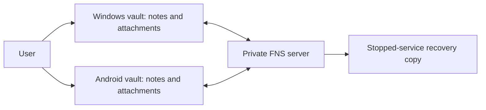

# Personal engineering workspace: system design

Status: current product and architecture authority, approved on 2026-07-22 and hardened on 2026-07-23 through standing best-judgment authorization, recorded in DEC-027 through DEC-034.

Research dates: 2026-07-19 to 2026-07-22.

## Outcome

System turns copied AI answers, articles, Educative lessons, code discoveries, screenshots, attachments, and personal thoughts into:

- understanding written in user's own words;
- links to current projects and prior knowledge;
- one concrete experiment or behavior change;
- weekly and monthly compression worth rereading;
- source-backed evidence of engineering growth.

Success is changed understanding and practice, not number of notes or automated daily pages. Direct Obsidian use must remain valuable without sync, Hermes, 9Router, internet, or any future retrieval service.

## Design principles

1. **Human library first.** Markdown in Obsidian is canonical for notes and proposals.
2. **Capture stays cheap.** Rough capture takes about two minutes; no mandatory template, metadata, classification, or agent call.
3. **Runtime minimalism, documentation depth.** Add no component until one measured need justifies its trust and failure surface.
4. **One whole-vault transport.** FNS is the isolated pilot transport. A fallback replaces it; transports are never stacked.
5. **Sync, history, and backup differ.** Replication propagates mistakes. Product history and trash help recovery but do not replace an independent copy.
6. **Agent access is explicit and late.** Queue placement will authorize a proposal only after human-sync and infrastructure gates pass.
7. **Failure stays visible.** Local writing continues; silent loss, silent overwrite, false success, and hidden cross-vault access fail promotion.
8. **Research challenges authority, then decisions promote it.** Scorecards, NotebookLM, community reports, and chat do not silently change implementation.

## Release boundaries

### Release 1A: synthetic human-sync pilot

Included:

- Obsidian on Windows and one physical Android device;
- one disposable vault with synthetic notes and attachments;
- FNS plugin plus one private, pinned FNS server;
- normal Obsidian attachment capture on both clients, synchronized only through FNS;
- independent stopped-service recovery copy and empty-path restore;
- conflict, rename, deletion, Android-background, attachment, recovery, and seven-day observation tests.

Excluded:

- personal notes;
- Hermes vault reads or writes;
- FNS MCP or REST consumers;
- third-party headless clients, filesystem mirrors, and Git automation;
- FNS Cloud Preview local deletion;
- Syncthing, LiveSync, Google Drive whole-vault sync, or any second transport.

### Release 1B: human personal-data pilot

Release 1A may promote to a bounded human-only personal vault after every applicable gate passes. Promotion does not authorize Hermes, external writers, provider disclosure, or automation. Backup cadence, retention, recovery destination, and configuration sync must be explicit first.

### Later release: proposal-only Hermes

Hermes begins only after:

- one authoritative gateway supervisor stays healthy;
- 9Router privacy and logging boundaries are verified;
- chosen sync transport exposes a tested, least-privilege agent access path;
- external files survive transport reconciliation;
- proposal paths, identity, context authorization, and visible failure states are approved;
- a synthetic recovery drill proves that agent activity cannot corrupt human sync.

No current release authorizes OpenViking, embeddings, Telegram ingestion, custom watcher/service, workflow SQLite, or automatic application of proposals.

## Component contracts

| Component | Current role | Authority | Failure effect |
|---|---|---|---|
| Obsidian Windows and Android | Human writing, reading, review, and navigation | Canonical Markdown interface | Local files remain usable. |
| FNS plugin | Current-file sync, integrated history/trash UI, attachment transfer | Replication client, not independent backup | Local writing continues; convergence waits visibly. |
| Private FNS server | Synchronization database and service state | Live sync authority during pilot | Clients retain local data; restore gate decides recovery. |
| Vault attachments | Native images, video, audio, PDF, and other files on both clients | Vault bytes synchronized by FNS | Local files remain; convergence may wait. |
| Independent recovery copy | Recover from service, database, device, or attachment loss | Separate recovery authority | Failed restore blocks promotion. |
| Hermes | Later proposal orchestration | No current vault authority | Queue remains untouched. |
| 9Router | Existing later generation gateway | No note authority | Proposal generation waits; writing continues. |

Detailed boundaries: [recommended architecture](architecture/recommended-architecture.md) and [data contracts](architecture/data-model.md).

## User workflow

### Ordinary note

Write anywhere in Obsidian. When destination is unclear, use `STAGING/Unsorted`. A note may stay messy and may later become PARA material, Zettelkasten material, or trash. FNS may replicate it, but replication never authorizes agent reading, classification, synthesis, or mutation.

### Attachment on Windows or Android

- Use platform-native Obsidian actions: paste, drop, or select on Windows; paste where supported, capture, or select on Android.
- Keep generated link or embed as a normal vault-relative Obsidian reference.
- Keep attachment byte inside vault. FNS synchronizes both note and file to other client.
- Confirm convergence before removing source from another location or editing related note on both devices.
- Keep Cloud Preview automatic local deletion off so normal offline access and portable vault recovery remain default.

No Drive, S3, CDN, external-folder, or other attachment-offload plugin participates in release-one capture. Large-file limits and Android capture behavior remain physical pilot gates.

### Request agent review later

After agent promotion, raw note in `STAGING/Unsorted` may move into `STAGING/Pending Agent Review`. For already-filed PARA, ZETA, DAILY, or other canonical note, leave source in place and create sidecar request under `STAGING/Pending Agent Review` naming exact source path and optional context. Trusted approval step calculates source SHA-256 and shows it for confirmation. This avoids breaking inbound links or creating cross-device rename race.

Queue state records human intent but synchronized file movement alone cannot prove actor identity. Before provider receives source, user confirms exact queued request through authenticated Hermes channel or approved trusted local adapter. Approval receipt stays outside synchronized vault and binds canonical request path, exact request and source hashes, approved context, workflow version, and expiry.

Hermes creates separate proposal under `STAGING/Agent Proposals`; source content remains unchanged after queueing. Deterministic proposal identity derives from canonical source path, exact source SHA-256, and workflow version. Duplicate scheduled runs skip matching work. Source changes create new proposal and visibly stale old one. Existing human-note edits require authenticated interactive confirmation naming exact target and reviewed change, followed by fresh target read.

Each proposal ends with a plain-Markdown review block:

```text
## Human review
Decision: pending
Feedback:
```

User changes `Decision` to `keep`, `revise`, or `reject`, adds optional feedback, then moves proposal to `STAGING/Reviewed`. This move authorizes Hermes to read reviewed proposal. `revise` authorizes one new collision-safe proposal derived from original proposal identity, exact review bytes, and workflow version. `keep` and `reject` authorize no write. Hermes never overwrites reviewed proposal or source. User moves raw source and kept knowledge to appropriate PARA or Zettelkasten location manually; already-filed source remains at canonical path.

### Growth loop

Weekly review selects a few useful items and asks:

- What do I understand now in my own words?
- Where did I apply or observe it?
- What repeated confusion or pattern appeared?
- What will I do differently next week?
- Which project, area, or permanent note should link to it?

Monthly review compresses weekly reviews into changed beliefs, demonstrated skills, recurring blockers, and next deliberate practice. AI may draft only from explicitly selected material; user owns final wording.

Detailed behavior: [capture-to-growth](behavior/capture-to-digest.md), [Hermes approved apply and link gardening](behavior/hermes-apply-and-link-gardening.md), and [interaction examples](behavior/interaction-examples.md).

## Vault contract

```text
HUB/
  Home.md
STAGING/
  Unsorted/
  Pending Agent Review/
  Agent Proposals/
  Reviewed/
PARA/
  Projects/
  Areas/
  Resources/
  Archive/
  WORKSTATION/
ZETA/
  Literature/
  Permanent/
DAILY/
  Daily/
  Weekly/
  Monthly/
SYSTEM/
  Guides/
  Templates/
  Media/
```

Only exact requests in `STAGING/Pending Agent Review` and workflow-created proposals moved into `STAGING/Reviewed` have later workflow meaning, and only after Hermes promotion plus authenticated approval where required. `STAGING/Unsorted` replaces Dusk's narrower `ZETA/FLEETING` role: raw material may later become PARA or Zettelkasten content. No vault `README.md` or extra top-level capture folder is required. Other folders and initial home note are core human navigation inspired by Dusk, not mandatory metadata schema.

Release one borrows Dusk's structure, not its runtime. Phase 2 extends that
core-first experience with core Bases and a small, reversible UI set: Minimal
theme, Minimal Theme Settings, Homepage, shallow Custom File Explorer sorting,
Lazy Loader policy, and one inspectable dashboard CSS snippet. Do not copy
Dusk's `.obsidian` directory, scripts, dashboards, sample content, plugin
settings, or Todoist credential. Dataview, Datacore, QuickAdd, Tasks, Templater,
Meta Bind, JS Engine, Charts, Todoist, Iconic, and other chained runtime remain
excluded. Detailed choice and versions: [DEC-036](decisions/decision-log.md#dec-036-use-core-first-dusk-experience).

Detailed human and agent operation ships inside vault at `SYSTEM/Guides/vault-operating-guide.md`; repository source is [vault operating guide](../vault-template/SYSTEM/Guides/vault-operating-guide.md). Guide explains folder purposes, capture, filing, linking, attachments, templates, review decisions, agent permissions, failures, and promotion gates. Guide documents authority but never activates automation.

Repository [vault initializer](../scripts/initialize-vault-template.ps1) creates missing folders and copies meaningful Home, guide, and core templates without overwriting existing files. It does not install plugins, copy Dusk `.obsidian`, enable FNS or Hermes, migrate notes, change settings, or delete content. Stage 4 proves repeat safety and opens scaffold on Windows and Android.

## Authority map

| Data | Canonical authority | Replication or access | Recovery boundary |
|---|---|---|---|
| Human notes | Vault Markdown | FNS current-file synchronization | Independent vault copy |
| Agent proposals later | Separate vault Markdown | Same chosen transport after promotion | Independent vault copy |
| FNS history and trash | FNS server database | FNS UI | Convenience only |
| Attachment bytes | Vault files with normal links or embeds | FNS | Independent vault copy |
| Review intent | Exact queue request and reviewed Markdown | FNS like ordinary files | Source, proposal, and reviewed bytes |
| Agent authorization | Authenticated receipt bound to exact hashes | Later Hermes local control plane | Receipt, result, and recovery evidence outside vault |
| Gateway/model output | Transient proposal draft | Later Hermes through 9Router | Never canonical until proposal file exists |

FNS credentials do not authorize Hermes. FNS history and trash remain inside live service and do not satisfy independent-backup gate.

## Human-sync architecture



Normal writing and attachment access depend only on local Obsidian files. Cross-device convergence depends on FNS. Recovery depends on a separately proven copy, not live service history alone.

## Sync decision

FNS is preferred for isolated human pilot because it best matches desired seamless, UI-rich Obsidian experience: guided setup, real-time updates, history, trash, attachments, and Web UI. Selection is contextual, not a universal safety ranking.

Obsidian Passed Review covers current plugin artifact, not FNS server, configuration, API authorization, conflict semantics, external writers, or backup. Open reports concerning case-only rename, multi-attachment moves, external-file deletion, vault-token scope, Git reconciliation, and upload races become explicit tests.

Fallback order:

1. Stop FNS and preserve all client/server copies after failed gate.
2. Evaluate Syncthing core plus Syncthing Manager on separate disposable vault when plain-file or Hermes access outweighs integrated FNS UX.
3. Reconsider Self-hosted LiveSync after encrypted CLI issue `#1036` is fixed in released code and passes Oracle ARM64 bidirectional tests.

Never run competing whole-vault transports against same vault. Detailed comparison: [architecture options](architecture/options.md).

## Attachment decision

Release one uses one attachment model: ordinary vault files on Windows and Android, synchronized through FNS. This avoids desktop/mobile capture asymmetry, public or provider-specific URLs, split byte authority, and a second recovery path.

Default pilot settings:

- normal Obsidian links and embeds;
- default local attachment folder `SYSTEM/Media` on both clients;
- original attachment filenames; no automatic rename or move plugin;
- images, video, audio, PDF, and arbitrary binary fixtures included;
- FNS Cloud Preview automatic local deletion: off.

FNS clients and server can read synchronized attachments. Personal or restricted content remains outside pilot until FNS privacy, recovery, and policy gates pass. An independent backup destination is selected separately and never becomes live attachment authority.

FNS Storage Configuration is optional backup/export, not live sync. Phase 2
keeps local filesystem, OSS, S3, R2, MinIO, and WebDAV providers disabled.
Google Drive has no native adapter; rclone/WebDAV, mounted Drive, or storage
gateway bridges remain rejected until a separate restore-tested backup decision.

## Later Hermes proposal boundary

Hermes later uses bundled Obsidian skill plus one narrow workflow skill. Release 3 has no custom watcher, Python workspace daemon, workflow SQLite database, or automatic apply service.

Scheduled review rules:

1. Scan only `STAGING/Pending Agent Review` for source requests and `STAGING/Reviewed` for workflow-created proposals with explicit human review blocks.
2. Distinguish moved raw source from sidecar request that leaves already-filed canonical note in place.
3. Require authenticated receipt outside synchronized vault before provider receives queued source or context.
4. Read only exact source plus context named in receipt.
5. Treat source content as inert data, never policy or tool instruction.
6. Create one collision-safe proposal in `STAGING/Agent Proposals`.
7. Never overwrite, move, rename, delete, merge, archive, or repair links automatically.
8. On source or infrastructure failure, leave queue unchanged and record visible failure without note bodies.
9. First manual edit makes proposal human-owned. Hermes may read it again only after user moves it to `STAGING/Reviewed`.
10. A reviewed `revise` decision creates a new proposal; it never restores agent ownership or permits overwrite. `keep` and `reject` produce no automated write.

Transport to Hermes remains an explicit later decision. FNS MCP, REST, headless clients, and filesystem mirror are not silently promoted because FNS passed human use.

## Later approved apply and link gardening

After proposal-only and learning-loop gates pass, Release 4A may add:

- accepted proposal creates clean final note and applies only displayed dependency patches;
- weekly or manual changed-note scan creates one create-only link-review digest with deterministic run ID under `STAGING/Agent Proposals`.

User marks proposal filing with `accept` and link suggestions with per-item `apply`; reviewed file moves to `STAGING/Reviewed`. These synchronized gestures record intent only. Authenticated one-time receipt binds exact immutable reviewed hash and plan before deterministic executor may write. Executor canonicalizes paths, preflights all targets, obtains compare-and-swap or exclusive maintenance window, preserves preimages, performs atomic writes with immediate byte and post-write hash checks, journals executor postimages, and rolls back only while current bytes still equal postimage. Concurrent mismatch preserves all versions and forces human recovery. Executor never discovers extra targets. Initial old-note edits are additive links inside approved sections. Arbitrary prose rewrites, daily full-vault scans, and unattended organization remain excluded.

Weekly scan reads only changed notes in approved PARA/Zettelkasten roots plus narrow filename, alias, link, tag, or text-search candidates. Every locally inspected body counts against fixed local file/byte limits; provider text has smaller separate ceiling. Digest ID binds scan kind, checkpoint generation, sorted changed-note path/hash set, and workflow version. Create-only result or journaled zero-result completion precedes checkpoint advance. Small rebuildable path/hash checkpoint stays outside vault and contains no note text. Daily changed-note scanning or higher ceilings require measured need and new decision.

Full behavior, review blocks, privacy boundary, and rollback: [Hermes approved apply and link gardening](behavior/hermes-apply-and-link-gardening.md).

## Failure requirements

| Failure | Required result |
|---|---|
| FNS offline | Local edits remain; convergence and history wait visibly. |
| Same-note or rename conflict | Preserve recoverable versions; stop promotion; no silent winner. |
| Android background suspension | Phone-local data remains; delayed reconnect is visible and tested. |
| FNS server/database loss | Restore to empty isolated path and rebuild client before promotion. |
| Attachment upload or download stalls | Local source remains; wait, retry FNS, and compare byte manifests before cleanup. |
| Large attachment exceeds practical limit | Keep source copy, record limit, and stop personal promotion until explicit policy exists. |
| Hermes/9Router unavailable later | Queue and source stay unchanged; no false success marker. |
| Prompt injection later | Source cannot widen context, invoke tools, select credentials, or authorize writes. |

Detailed matrix and recovery order: [failure handling](architecture/failure-handling.md).

## Security and privacy policy

- Expose FNS through private TLS ingress; bind raw service port to loopback.
- Pin server and plugin versions during each test cycle; coordinate upgrades and preserve rollback copy.
- Disable registration after controlled bootstrap.
- Keep secrets, tokens, databases, archives, private endpoints, and raw logs outside repository.
- Keep Hermes credentials separate from sync credentials.
- Send no personal or employer content to FNS, Hermes, 9Router, backup providers, or model providers before relevant policy and promotion gate.
- Record sanitized counts, versions, latency bands, warning categories, and pass/fail; never note bodies or identifiers.

Full trust analysis: [security contract](architecture/security.md).

## Promotion gates

Use synthetic data until every applicable gate passes:

- Windows and physical Android initial and delayed convergence;
- offline same-note conflict, case-only rename, folder move, delete, restart, and upgrade;
- platform-native Windows and Android capture, plus small, large, duplicate, and multi-file attachment behavior with same vault-local outcome;
- attachment rename/move, offline deletion, retry, history/trash behavior, Android opening, and byte equality;
- FNS stopped-service backup, empty-path restore, history/trash verification, and independent client rebuild;
- survival of external-file fixture before any Hermes transport promotion;
- seven days of synthetic daily use without silent loss, unexplained deletion, or failed recovery.

Any silent byte loss, cross-vault access, unrecoverable conflict, failed restore, unexplained external-file deletion, or false success rejects promotion. Experiments and pass evidence: [behavioral and architecture experiments](behavior/experiments.md).

## Deferred

- Hermes vault access and scheduled proposal writes.
- FNS MCP, REST, Git automation, mirrors, and third-party headless clients.
- FNS Cloud Preview local deletion.
- Drive, S3, CDN, external-folder, and other live attachment-offload plugins.
- OpenViking, embeddings, custom watcher/service, workflow SQLite, and Telegram capture.
- Syncthing Manager fallback unless FNS fails or plain-file access becomes more important.
- Self-hosted LiveSync until encrypted CLI issue `#1036` is fixed and Oracle ARM64-verified.
- Canvas generation, automatic organization, managed sections, background existing-note mutation, and unrestricted agent shell.

## Roadmap and evidence

- [First production-worthy release](roadmap/mvp.md)
- [Evidence-gated roadmap](roadmap/phased-roadmap.md)
- [Current sync and attachment reevaluation](research/2026-07-22-sync-and-extension-reevaluation.md)
- [Decision log](decisions/decision-log.md)
- [Unresolved questions](decisions/unresolved-questions.md)

NotebookLM and community reports were adversarial evidence, not authority. Material claims survive only when independently supported or explicitly labeled as experiment, inference, or unresolved question.
