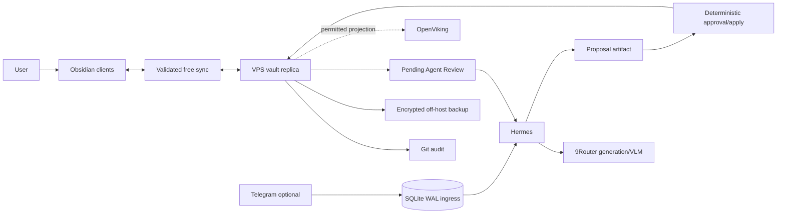

# Personal engineering workspace: system design

Status: design revised after adversarial review; implementation not started.

Research dates: 2026-07-19 to 2026-07-21.

## Outcome

System should turn copied AI answers, articles, Educative lessons, code discoveries, screenshots, and personal thoughts into:

- understanding written in user's own words;
- links to current projects and prior knowledge;
- one concrete experiment or behavior change;
- weekly and monthly compression worth rereading;
- source-backed evidence of engineering growth.

Automatic daily pages and accumulated notes are not success. Direct Obsidian use must remain useful without Hermes, OpenViking, 9Router, Telegram, or internet access.

## Authoritative choices

1. Logical Obsidian vault is canonical human library.
2. Dusk-inspired PARA/Zettelkasten folders remain optional navigation, not capture form.
3. `INBOX/Unsorted` accepts anything. `INBOX/Pending Agent Review` requests a Hermes proposal.
4. Existing notes are human-owned and review-required. Sync events do not establish authorship.
5. Deterministic workspace service, not LLM, enforces paths, hashes, atomic writes, approvals, and idempotency.
6. SQLite may store operational jobs/proposals and optional Telegram raw ingress; it is not canonical knowledge.
7. Git is audit/rollback. Sync and encrypted off-host backup are separate contracts.
8. OpenViking is a rebuildable derived projection added after core workflow passes.
9. 9Router handles replaceable generation/VLM after data policy permits it. Raw capture and vault use survive its outage.
10. Embeddings are pinned and fail closed; combos cannot substitute models.

Full workspace contract: [Obsidian workspace specification](superpowers/specs/2026-07-20-obsidian-openviking-workspace-design.md).

## User workflow

### Ordinary note

Write anywhere in Obsidian. No frontmatter, template, or agent required. Note may remain in `INBOX/Unsorted`. Sync and Git may copy/checkpoint it; neither triggers synthesis or mutation.

### Agent review

Move note into `INBOX/Pending Agent Review` or issue explicit command. Local policy resolves data class before any external call; unlabeled notes default to `local_only`. Hermes treats source as untrusted data, reads only permitted context, then creates proposal. Source remains unchanged. Approval tool verifies expected SHA-256, path policy, and output validity before atomic apply and Git commit. Changed base makes proposal stale.

### Growth loop

Weekly review selects few useful items and asks:

- What do I now understand in my own words?
- Where did I apply or observe it?
- What repeated confusion or pattern appeared?
- What will I do differently next week?
- Which project, area, or permanent note should link to it?

Monthly review compresses weekly reviews into changed beliefs, demonstrated skills, repeated blockers, and next deliberate practice. AI may draft; user accepts wording.

### Optional Telegram

Telegram is convenience, not main interface. Separate pre-agent ingress uses full-synchronous SQLite WAL. Text/link gets `Saved` only after commit; media first gets `Saved metadata; attachment pending`, then `Attachment saved` after bytes/checksum persist. Hermes lifecycle memory and OpenViking ingestion are downstream because neither proves durable receipt before model execution.

## Runtime architecture

Critical path for normal writing is Obsidian plus local disk. Critical path for cross-device convergence is chosen sync. Critical path for accepted agent mutation adds deterministic workspace service. 9Router and OpenViking remain retryable downstream components.

## Sync decision

No paid Obsidian Sync assumption. Git-only live sync is not recommended for phone-heavy use. Syncthing is not preferred because official Android app was discontinued in December 2024; community clients introduce maintenance risk.

Two candidates require device-level experiment:

| Candidate | Why consider | Must prove |
|---|---|---|
| Self-hosted LiveSync | Obsidian clients on supported platforms; self-hosted backend; recent headless CLI | ARM64 footprint, setup/recovery, delete/rename behavior, conflicts, backup |
| Remotely Save | Free plugin with several storage backends; simpler remote service possible | VPS-side convergence, E2EE compatibility, same-note conflict handling, deletes/renames |

Never run competing sync plugins on same vault. Never automatically merge propagated conflict files. Exclude `.git`, volatile `.obsidian` state, temp/conflict files, proposal journals, and service databases according to tested contract.

## Mutation safety

Workspace tool must enforce:

- vault-root realpath containment and path allowlist;
- forbidden `.git`, `.obsidian`, sync/system/secret paths;
- expected-base hash and idempotency key;
- per-path agent lease, stable-file check, post-write result hash, and exact staged-Git-blob verification;
- same-directory atomic replacement with durability flush where supported;
- proposal/apply journal in SQLite WAL;
- post-write Markdown/JSON validation;
- Git commit only after accepted mutation;
- explicit review for update, move, rename, merge, archive, and delete.

Hermes gets no generic destructive shell over vault. Copied note/web/AI content is inert data, never system or tool instruction. Proposal drafting runs without shell, write, credential, deployment, or messaging tools. Explicit user-requested research uses allowlisted tools and cannot be initiated by instructions found inside sources. Agent-generated disposable reports may auto-write only under approved generated directory.

## OpenViking lifecycle

OpenViking indexes a permitted projection, never edits canonical pages. First OpenViking role is derived vault projection only; native non-rebuildable agent memory remains disabled until separate authority, retention, deletion, and backup policy exists. A manifest records stable identity/path, content hash, sensitivity, desired state, observed Viking URI/task, model contract, and last success. Reconciler explicitly schedules verified add/move/remove/update behavior; unsupported content update semantics remain experiment. Projection failure never blocks vault.

## Model and privacy policy

Data classes: `public`, `personal_external_ok`, `local_only`, `work_restricted`. Missing label defaults to `local_only`; suspected workplace material defaults to `work_restricted`. Policy resolves locally from explicit path rule, sidecar, or user decision; external model cannot classify whether content may be disclosed. Restricted content cannot be sent to arbitrary/free 9Router providers, external VLMs, embeddings, or request-body logs.

9Router remains centralized gateway for permitted replaceable classification, summaries, weekly synthesis, and OCR/vision. Generation fallback may change models only where quality substitution is acceptable. Direct fixed-provider route remains evaluation/rollback option.

Embedding identity is index schema: provider, exact model, dimensions, normalization/preprocessing, chunking, metric, and generation ID. Compare exact no-substitution 9Router route against local Ollama `embeddinggemma`; benchmark bilingual retrieval, ARM64 throughput, memory, rebuild time, and outage behavior. Local CPU VLM/reasoning fallback is not planned.

## First release

Build a durable foundation, not throwaway prototype:

1. Create vault structure, guide, minimal templates, and weekly/monthly review habit.
2. Select free sync through conflict/offline/recovery experiment.
3. Add Git checkpoints, encrypted off-host backup, and restore drill.
4. Add proposal-only Hermes workflow and deterministic mutation service.
5. Connect permitted generation to existing 9Router with privacy/log controls.

OpenViking, Telegram ingress, Canvas generation, vector search, automatic organization, and managed-section writes wait for evidence gates.

## Failure requirements

| Failure | Required result |
|---|---|
| Hermes/9Router/OpenViking down | Ordinary Obsidian use and sync continue |
| Sync down | Local edits remain; convergence status visible; no agent inference from partial transfer |
| Concurrent edit | Expected hash fails; proposal becomes stale; no overwrite |
| Sync changes file after apply | Result/staged-blob verification preserves approved Git object; working-tree divergence enters reconciliation |
| Invalid model output | Proposal rejected; canonical note unchanged |
| Prompt injection in copied source | Source stays inert data; drafting has no privileged tools; tool-seeking output is quarantined |
| Git commit failure | Mutation marked uncommitted and reconciled before more agent writes |
| OpenViking failure | Projection retries; vault remains canonical |
| Telegram downstream outage | Raw committed update queues; `Saved` already truthful |
| Telegram disk/SQLite failure | No `Saved` |
| Backup failure | Visible alert; restore status remains failed |

Detailed recovery: [failure handling](architecture/failure-handling.md).

## Evidence gates

- Four-week workflow yields useful weekly review in three weeks and one concrete changed action each useful week.
- Sync tests cover offline concurrent same-note edit, rename, delete, attachment, Canvas file, VPS restart, and recovery without silent loss.
- Restore drill reconstructs vault, Git history, configuration, and proposal state.
- Agent cannot write forbidden paths; stale proposal never overwrites current bytes; approved proposal applies once.
- Copied prompt-injection fixture cannot invoke tools, widen context, alter policy, or bypass review.
- Restricted test note never reaches 9Router/OpenViking external model path or raw logs.
- OpenViking pilot must beat plain filename/link/text search on a prewritten query set before promotion.

## Research discipline

NotebookLM was used as adversarial partner, not authority. It forced useful questions and retractions, but also proposed paid Obsidian Sync despite constraint and made unsupported implementation/security claims. Project retains only independently supported facts or explicitly labels experiments and inference. See [adversarial review](research/notebooklm-adversarial-review.md), [decision log](decisions/decision-log.md), and [unresolved questions](decisions/unresolved-questions.md).
