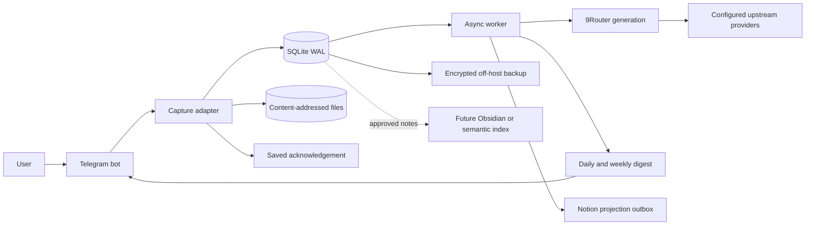

# Personal knowledge pipeline: complete system design

Status: **Research complete; behavior and architecture proposed for experiments.**
Research date: **2026-07-19**. This document is authoritative for current recommendation. Supporting documents preserve detailed evidence.

## 1. Problem

Useful material appears in AI chats, browser articles, Educative lessons, code work, screenshots, and personal thoughts. Current habit copies source material into blank pages without context or forgets it. Automatic daily pages would remove one mechanical step but would not create understanding, retrieval, or growth.

System should help answer later:

- What did I learn, in language I understand?
- Why did it matter in real work?
- What original source supports this note?
- What should I practice or change?
- Which confusion, solution, or skill repeats across weeks?

Primary outcome is learning retention and engineering growth. Career evidence and improved execution are useful side effects. Page count, stored-token count, and embedding count are not outcomes.

## 2. Evidence labels

- **Verified current-state fact:** observed directly or confirmed by official source at recorded version/date.
- **Raw research finding:** source evidence preserved without claiming project fit.
- **Analysis:** interpretation of evidence.
- **Recommendation:** proposed design, not deployed fact.
- **Experiment:** test needed before promotion.
- **Decision:** status-qualified record in [decision log](decisions/decision-log.md).
- **Unresolved:** missing evidence or choice kept visible.

## 3. Verified current state

### User behavior and Notion

- Useful captures span AI, browser/Educative, and coding work; input may be text, link, image, file, quote, or thought.
- Sustainable manual effort is roughly two minutes per normal workday.
- Inspected Notion database has four dated journal rows: two `Done`, two `Not started`; every Summary property is empty.
- Existing template asks for tasks, learning, problems/solutions, and links. It does not enforce a minimum useful entry or create later consolidation.
- Official Notion repeating database templates can create daily pages. Official API still requires idempotent integration behavior and handling of limits, webhooks, retries, and page ordering.

### VPS and existing components

Read-only inspection on 2026-07-19 found:

- Hermes Gateway connected to Telegram polling.
- Hermes custom model provider targets a loopback OpenAI-compatible `/v1` endpoint served by 9Router. Hermes generation therefore currently depends on 9Router; not every Hermes tool/background path was proven to do so.
- 9Router v0.5.35 online under PM2. Its SQLite schema contained 30 provider connections across seven provider types, 22 active connections, four model combos, two multi-model combos, five active proxy pools, and one active client API key.
- 9Router logs and database contain operational/request detail. Aggregated logs show fallback, retry, timeout, 429, 403, and 5xx activity; this proves failure paths execute, not successful semantic recovery.
- Three 9Router migration/upgrade snapshots existed. No recurring or off-host backup and no restore test were verified.
- Secret files had owner-only mode. 9Router database/directories were more broadly readable/traversable; service bound all interfaces; host UFW was inactive. Direct port reachability timed out from one network, while a TLS tunnel route worked. Cloud/network/tunnel controls therefore carry part of perimeter security.
- Supermemory server v0.0.5 was running. Its embedding plan pinned `gemini-embedding-2-preview` at 768 dimensions through an endpoint different from user-managed 9Router.

Identifiers, endpoints, accounts, credentials, raw log lines, request bodies, provider order, and database contents are intentionally redacted. Point-in-time process findings may become stale.

### Repository history

Public repository `tienbac2314/my-opencode-setup` at commit `a2d3ae4b74cccd45871b883555b3d696b129c429` records migration from Mem0 to Supermemory, 9Router model-discovery fixes, and later OpenViking research/pilot planning. Current boundary found there was Supermemory active and OpenViking inactive. This is historical context, not proof those tools fit this pipeline.

Detailed paths/commits: [repository history](current-state/repository-history.md). Redacted host evidence: [VPS inventory](current-state/vps-inventory.md) and [VPS findings](../research-notes/vps-findings.md).

## 4. Raw research findings and analysis

Official-source versions/commits are listed in [source register](../research-notes/official-sources.md).

| Component | Raw finding | Project analysis |
|---|---|---|
| Telegram | Stable update IDs, replies, media groups, files, polling/webhooks | Best existing low-friction capture/review UI; not durable truth |
| Hermes | Telegram gateway, scheduling/tools, custom OpenAI endpoint | Useful orchestrator, but agent execution/session memory cannot substitute for pre-model durable capture |
| 9Router | OpenAI-compatible translation, account/model fallback, usage, SQLite | Strong centralized generation gateway; unsafe as capture dependency or transparent embedding router |
| Notion | Databases, API, webhooks, repeating templates | Familiar review projection; weak ingestion queue/canonical raw store |
| Obsidian | Vault is local Markdown files | Good portable future editor over deterministic export; not required for ingestion |
| Supermemory | Self-hosted retrieval/memory server with fixed embedding plan | Candidate shadow index; existing deployment lowers trial cost but does not solve capture behavior |
| OpenViking | Context/resource backend with pinned model configuration | Candidate future shared agent context; AGPL and operational/migration cost require isolated pilot |
| SQLite/files | Transactional state plus portable binary/text storage | Best MVP truth for one operator and low volume |

### Main 9Router question

| Policy | Benefit | Failure | Decision |
|---|---|---|---|
| Route all LLM and embeddings | One endpoint, provider/account fallback, usage view | Gateway blast radius; mixed embedding semantics; weak reproducibility | Rejected |
| Route replaceable generation; pin embeddings | Reuses current gateway where substitution is tolerable; stable vector contract | Two endpoint/credential policies; generation waits during outage | Recommended |
| Bypass 9Router | Isolation and deterministic direct provider | Duplicates provider/account management | Keep as rollback and evaluation mode |

Official 9Router architecture documentation still mentions JSON persistence while current Docker guidance and inspected v0.5.35 deployment use SQLite. Treat old storage description as stale. Details: [9Router evaluation](research/9router.md).

### Semantic search timing

Current evidence shows capture/review failure, not search failure. MVP uses metadata, topic/project fields, source links, backlinks, and SQLite FTS. Vector search requires a labeled query set showing material misses. Any later index pins provider/model/dimensions/preprocessor/chunker/metric and stores an index-generation ID. Model change builds a new disposable index; outage fails closed.

## 5. Requirements

### Behavioral

- Accept unstructured text, URLs, replies, forwards, images, and files.
- Ask no mandatory capture-time form questions.
- Confirm durable save quickly and visibly.
- Distinguish source summary from personal interpretation.
- Group conservatively; time proximity alone never merges notes.
- Ask at most one material ambiguity question per daily digest.
- Keep daily review under two minutes and generate only for active days.
- Build weekly review by topic/project, not chronological concatenation.
- Preserve one-click/ordinary-language correction and original evidence.

### Reliability and data

- Raw capture succeeds without 9Router, upstream providers, Hermes processing, Notion, or memory platforms.
- Acknowledgment occurs only after durable commit.
- Telegram replay is idempotent.
- Every derivation links to immutable source captures and processor/prompt/schema/model metadata.
- Retryable work survives restart; permanent failures remain inspectable and replayable.
- Projections and indexes can be rebuilt from canonical truth.
- Encrypted off-host backup and restore drills are part of MVP, not future polish.

### Security and privacy

- Allowlist Telegram user/chat; reject groups until intentionally tested.
- Classify captures as `personal`, `public-source`, `private-work`, or `restricted`; uncertainty defaults to restricted external processing.
- Treat captured content/web pages as untrusted data, never agent/tool instructions.
- Use scoped service keys; separate 9Router compatibility API from management access.
- Exclude secret/header/body values from logs and metrics.
- Enforce deletion/retention across raw records, attachments, projections, indexes, logs, and backups.

## 6. Proposed behavior

### Capture

1. Telegram update reaches capture adapter.
2. Adapter verifies allowed sender and derives stable source/idempotency key.
3. Adapter writes immutable raw payload, relationships, timestamps, attachment metadata, job, and outbox in one SQLite transaction.
4. Only after commit, bot replies `Saved`.
5. Attachment download may continue through retriable job; metadata remains durable if download fails.

No LLM, 9Router, Notion, embedding, or agent call occurs before step 4.

### Enrichment and grouping

Worker proposes title, topic, type, source summary, possible personal meaning, disposition, relations, and confidence. Output must match versioned schema. Derived candidates never overwrite raw capture.

Strong grouping signals: Telegram media group, reply chain, same source URL, explicit continuation, or high topic similarity inside bounded interval. Time alone is insufficient. Ambiguity remains separate until user says `same topic` or `separate`.

### Review

Daily digest contains:

- **Learn:** reusable explanation.
- **Practice:** one small exercise/work application.
- **Reference:** source worth retaining with minimal synthesis.
- **Temporary:** visible but not promoted.
- **Needs context:** at most one question.

Actions: `keep`, `practice`, `reference`, `temporary`, `fix`, or ignore. Weekly review selects strongest lessons, repeated confusion/blocker, one next practice target, reusable decisions/solutions, shipped/fixed career evidence, and consolidation candidates. Every claim links to source capture.

## 7. Architecture options

### A. Notion-first

Fast visible prototype, existing calendar/templates. Rejected as production truth because model/Notion outages enter capture path, raw/derived separation is weak, and local retry state is still needed.

### B. Local truth with projections

Telegram to capture adapter to SQLite/files; asynchronous worker calls 9Router and publishes Telegram/Notion projections. Recommended because volatile components can fail without losing capture and every future tool remains replaceable.

### C. Memory-platform-first

Supermemory/OpenViking own ingestion and recall. Rejected for MVP because inferred/indexed state can obscure sources, embedding/model availability becomes critical, and behavior remains unproven.

### D. Hermes-native

Lowest new deployment. Conditional: acceptable only if installed Hermes exposes a verified pre-agent durable hook. Otherwise Hermes invokes an external capture service or remains processor/scheduler/sender.

Tradeoff of recommended option: operator owns a small schema/service, two visible stores, and projection reconciliation. This cost directly buys capture independence and auditable provenance.

## 8. Recommended MVP architecture

One process may host adapter, worker, scheduler, and local API. SQLite jobs provide internal boundary. Split processes only after fault-isolation or load evidence.

### Component responsibility

| Component | MVP responsibility | Must not own |
|---|---|---|
| Telegram | Capture/review interaction | Durable truth |
| Capture adapter | Authentication, idempotent transaction, acknowledgment | Knowledge inference |
| SQLite/files | Canonical raw, jobs, provenance, FTS, attachments | UI polish |
| Hermes | Optional processing/scheduling/publishing | Sole raw persistence |
| 9Router | Replaceable classification/synthesis and permitted vision | Capture, embeddings with model fallback |
| Notion | Digest/approved-note projection | Raw queue |
| Obsidian/Supermemory/OpenViking | Future derived views | Canonical source |

## 9. Data model and lifecycle

Core records:

- `capture`: immutable source event, source identity/version, raw payload reference, content class, timestamps, checksum.
- `capture_group`: versioned grouping proposal and evidence.
- `processing_run`: purpose, input IDs, processor/prompt/schema/route versions, attempts, status, timing.
- `synthesis_candidate`: derived structured output, confidence, source IDs, supersession.
- `durable_note`: explicitly promoted knowledge with provenance.
- `digest`: covered period, selected candidates, delivery/review state.
- `feedback`: user correction/action targeting exact version.
- `relationship`: typed, directional, provenance-bearing link.
- `job`/`outbox`: leased retry state and idempotent external publication.

Lifecycle: `captured -> enrichment_pending -> candidate_ready -> reviewed -> promoted|temporary|discarded`. Failure creates `retry_wait` or `dead_letter`; it never deletes `captured`. Corrections supersede groups/candidates/notes and preserve prior versions.

Idempotency keys combine source identity and Telegram `update_id`; processing keys combine purpose, ordered source IDs, prompt/schema version, and route policy; projection keys combine destination, record ID, and version. Full schema: [data model](architecture/data-model.md).

## 10. 9Router integration policy

- Dedicated scoped client key and explicit purpose/route policy per job.
- Routine classification may use configured combo fallback.
- Weekly/quality-critical synthesis may require designated route/model.
- Record requested route, actual selected model when available, latency, attempt, status, prompt/schema version—never gateway secrets or private prompt bodies.
- Retry transport/429/5xx with bounded exponential backoff and jitter. Do not blindly retry auth, policy, or schema errors.
- Queue during gateway outage; capture and raw acknowledgment continue.
- Preserve direct-provider adapter as rollback/control for evaluation.
- Embeddings bypass substitutable combos. If a 9Router exact route is ever used, it must guarantee identical immutable embedding contract and fail closed.

## 11. Failure handling

| Failure | Required behavior |
|---|---|
| Duplicate update | Return existing acknowledgment; one capture |
| Disk/SQLite failure | Never say `Saved`; report failure if possible |
| Attachment failure | Preserve metadata; retry; surface pending/dead letter |
| Worker restart | Resume persisted leased jobs without duplicate derivation |
| URL/paywall | Preserve URL/excerpt; mark inaccessible |
| Prompt injection | Data-only model boundary; no tools; quarantine invalid output |
| 9Router unavailable | Queue processing; raw capture remains live |
| Provider 429/5xx | Permitted fallback/retry with selected-route evidence |
| Invalid model output | Validate, one bounded repair/alternate attempt, then dead letter |
| Embedding outage | Retry same pinned contract; never substitute |
| Notion outage/rate limit | Retain local note/digest; retry idempotent outbox |
| Concurrent Notion edit | Stop overwrite; create reconciliation task |
| Wrong group/class | Supersede and regenerate; preserve history |
| Missed schedule | Generate for actual range; no blank page requirement |
| Backup failure | Visible alert; restore status remains failed until proven |

Recovery order: protect canonical data; restore ingestion; drain attachments/outbox; restore processing/digests; rebuild projections/indexes.

## 12. Security, logging, and backup analysis

9Router concentrates provider credentials and may hold sensitive operational/request data. Compromise has wider blast radius than a single provider key. Tighten database/directory permissions, prefer loopback/private compatibility access, verify cloud/tunnel and dashboard policy, add host-firewall defense in depth, rotate/limit client keys, and test changes separately before production.

Metrics record stage counts, age, latency, status, route identity, disk growth, backup age, and restore status—not raw bodies. Rotate PM2/gateway logs and verify effective request-body logging at runtime.

Backup canonical SQLite with a consistency-safe method plus attachment files and configuration/schema versions. Encrypt before off-host copy. Restore drill must reconstruct captures, jobs/outbox, provenance, and attachment references. 9Router upgrade snapshots are useful migration safety, not disaster recovery; gateway DB needs its own encrypted scheduled backup and tested restore. Optional FTS/vector indexes remain rebuildable.

## 13. Experiments

1. **Two-week capture:** at least ten useful captures; median under 15 seconds; p90 under 30 seconds; none abandoned because structure was required.
2. **Grouping:** zero harmful merges; at most 20% of items need correction; corrections preserve raw input.
3. **Daily review:** median under two minutes; at least 70% of active-day digests reviewed; at least 60% of promoted items useful one week later.
4. **Weekly growth:** source-backed answers for four of five recall prompts, one next-week practice action, and no unsupported growth claim.
5. **Gateway outage:** three test captures commit and acknowledge without a model call; delayed jobs later process exactly once with raw bytes/metadata unchanged.
6. **Notion outage:** local approval persists; retry produces exactly one projection without data loss.
7. **Retrieval baseline:** at least six of eight real questions return a correct top-five result with provenance before any vector pilot.

These are summaries. [Behavioral experiments](behavior/experiments.md) is canonical for procedures, measures, thresholds, and failure responses.

## 14. Decisions and rejected shortcuts

Accepted: raw capture before every model/SaaS call.
Experimental: one bot and hybrid cadence.
Proposed: local SQLite/files truth, Notion projection, 9Router generation-only scope, pinned embeddings, no vectors in MVP, future tools as derived views.

Rejected for MVP: Notion-first truth, memory-platform-first truth, all calls through 9Router, transparent embedding fallback, immediate full synthesis, automatic grouping by time, blank daily-page generation, and autonomous deletion/consolidation.

Status/rationale/tradeoffs: [decision log](decisions/decision-log.md).

## 15. MVP and future architecture

Build order: durable capture; attachments/recovery; candidate processing; daily correction; weekly synthesis; Notion projection; encrypted backup/restore. Each stage has acceptance evidence and rollback in [MVP roadmap](roadmap/mvp.md).

Possible future path:

1. Deterministic approved-note Markdown export and Obsidian review.
2. Labeled retrieval evaluation and one pinned-embedding shadow index.
3. Supermemory or OpenViking pilot as rebuildable derived view.
4. Approved, provenance-linked context exposed to Hermes/development agents under strict tool/data policy.

Promote only on measured behavioral/retrieval gain. Do not add separate bots, queues, object stores, agent graphs, or dashboards without observed need.

## 16. Unresolved questions

Highest priority:

- Can Hermes provide pre-agent durable Telegram persistence, or is external adapter required?
- Which private-work content may reach external providers?
- What attachment retention, off-host backup target, and encryption recovery policy apply?
- Should Notion edits sync back, and how are conflicts resolved?
- Do controlled synthetic tests prove 9Router route quality, fallback provenance, body-log policy, restore, and outage recovery?
- Do two-week behavior metrics support one bot, grouping thresholds, daily review, and weekly value?
- When does measured retrieval failure justify pinned embeddings or a memory platform?

Complete list and inspection limits: [unresolved questions](decisions/unresolved-questions.md).

## 17. Source and traceability map

- Official source versions and URLs: [official source register](../research-notes/official-sources.md)
- Redacted live inspection: [VPS findings](../research-notes/vps-findings.md)
- Prior repository branch/commit/path evidence: [repository findings](../research-notes/repo-findings.md)
- Behavioral rationale: [capture-to-digest](behavior/capture-to-digest.md)
- Architecture comparison and component matrix: [options](architecture/options.md)
- Validated diagrams: [architecture diagrams](architecture/diagrams.md)
- Component evaluations: [research directory](research/storage-options.md)
